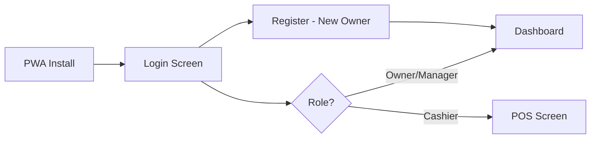
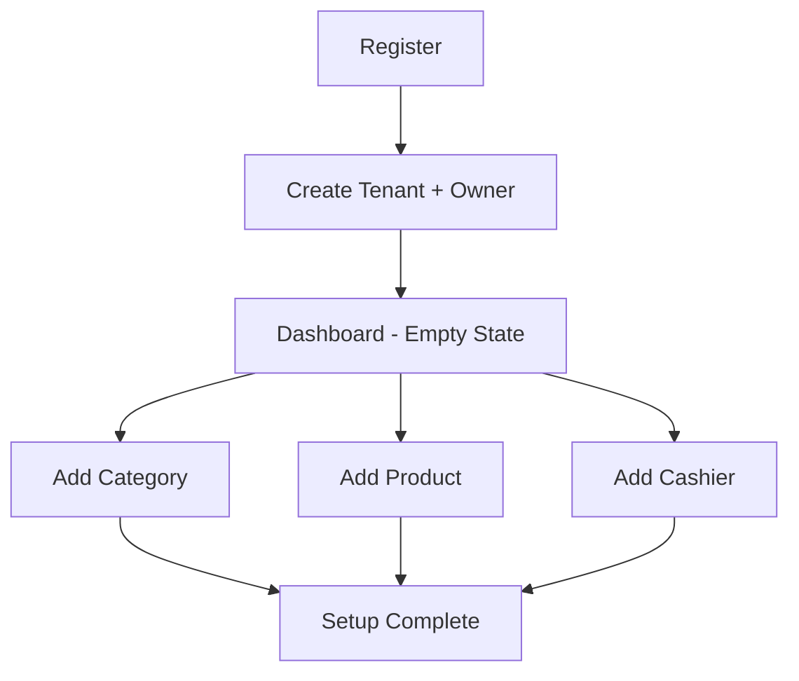
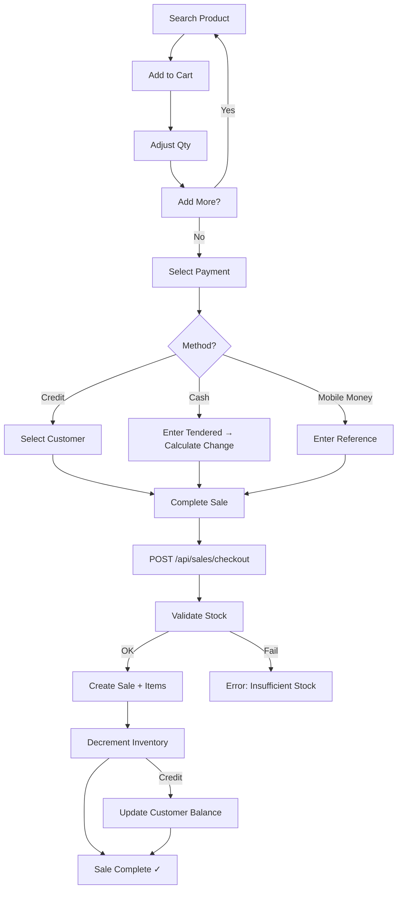
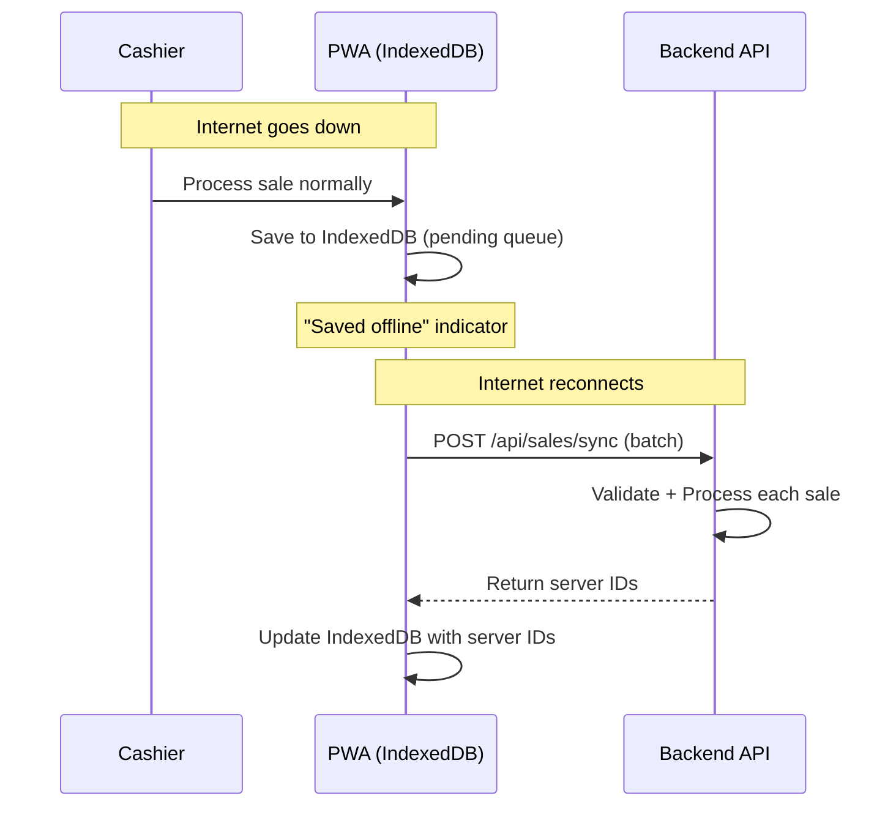
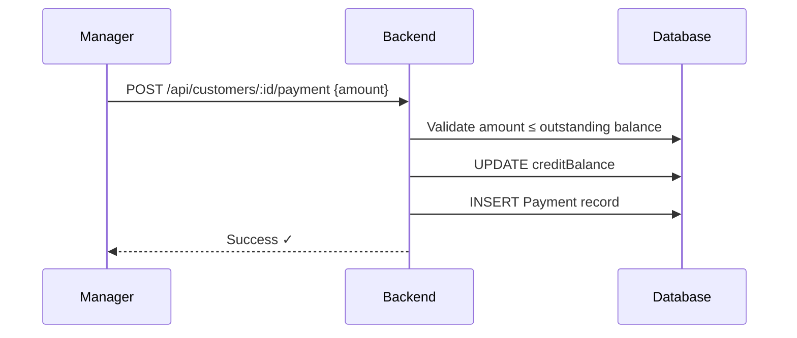
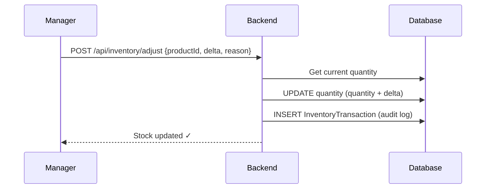

# Application Flow
## SmartBiz ERP Lite

---

## 1. Entry Points

---

## 2. Owner Onboarding

**Steps:**
1. **Register** → POST `/api/auth/register` → creates Tenant + Owner → JWT returned
2. **Dashboard** → empty state with onboarding cards
3. **Add Category** → POST `/api/categories`
4. **Add Product** → POST `/api/products` (inventory auto-created at 0)
5. **Add Staff** → POST `/api/users` → share credentials verbally

---

## 3. POS Sale Flow

**Checkout steps (backend):**
1. Validate products exist + belong to tenant
2. Validate sufficient stock for each item
3. If credit: validate customer + credit limit
4. BEGIN TRANSACTION → Create Sale → Create SaleItems → Decrement inventory
5. If credit: update customer `creditBalance`
6. COMMIT TRANSACTION

---

## 4. Offline Sale Flow

---

## 5. Customer Credit Payment

---

## 6. Inventory Adjustment

---

## 7. Error Flows

| Scenario | Trigger | Response |
|:---------|:--------|:---------|
| **Insufficient stock** | qty > available | Error: "Not enough stock for [product]. Available: [qty]" |
| **Expired JWT** | Any API call after 24h | 401 → Clear token → Redirect to login |
| **Credit limit exceeded** | balance + amount > limit | Error: "Credit limit exceeded for this customer" |
| **Sync conflict** | Two offline sales exceed stock | Server flags for review → Manager sees alert |
