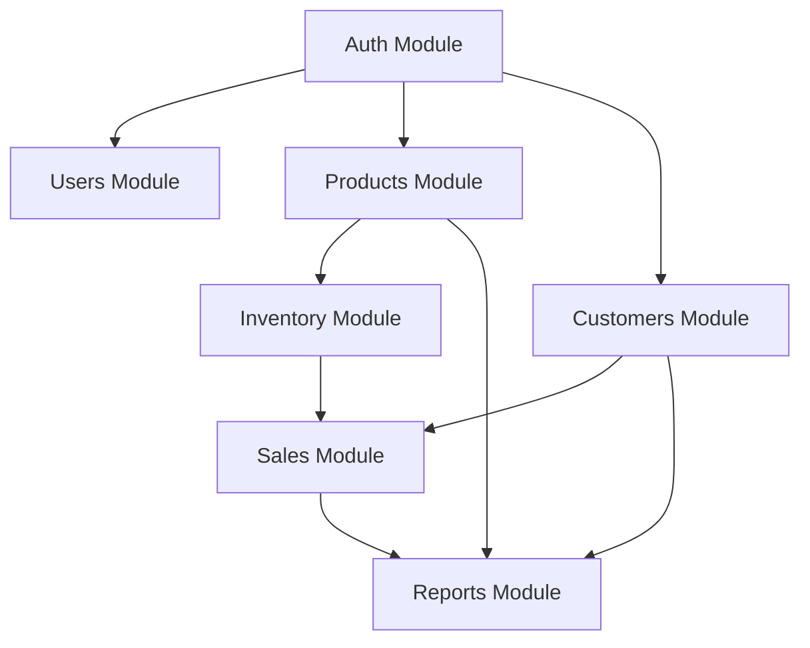
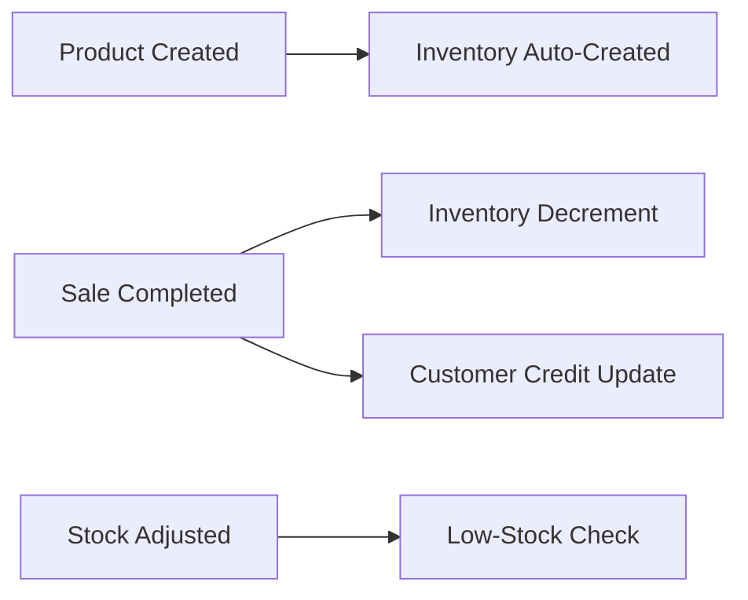

# Module Breakdown
## SmartBiz ERP Lite

---

## Dependency Graph

---

## Module Summary

| Module | Priority | MVP | Dependencies | Complexity |
|:-------|:---------|:----|:-------------|:-----------|
| Auth | P0 | Yes | None | Low |
| Users | P0 | Yes | Auth | Low |
| Products | P0 | Yes | Auth | Medium |
| Inventory | P0 | Yes | Products | Medium |
| Customers | P0 | Yes | Auth | Low |
| Sales | P0 | Yes | Products, Inventory, Customers | High |
| Reports | P0 | Yes | Sales, Customers, Products | Medium |

---

## Module Details

### 1. Auth Module
**Purpose:** Authentication, JWT management, session lifecycle.

| Feature | Endpoint | Priority |
|:--------|:---------|:---------|
| Register (Tenant + Owner) | POST `/api/auth/register` | P0 |
| Login | POST `/api/auth/login` | P0 |
| Get current user | GET `/api/auth/me` | P0 |
| Refresh token | POST `/api/auth/refresh` | P1 |

**Dependencies:** Prisma (User, Tenant), bcrypt, @nestjs/jwt, @nestjs/passport

---

### 2. Users Module
**Purpose:** Staff management — Owner creates/manages Manager and Cashier accounts.

| Feature | Endpoint | Priority |
|:--------|:---------|:---------|
| List users | GET `/api/users` | P0 |
| Create user | POST `/api/users` | P0 |
| Update user | PUT `/api/users/:id` | P0 |
| Deactivate user | DELETE `/api/users/:id` | P1 |

**Dependencies:** Auth Module, Prisma (User)

---

### 3. Products Module
**Purpose:** Product catalog, categories, pricing, landed cost calculation.

| Feature | Endpoint | Priority |
|:--------|:---------|:---------|
| List/Search products | GET `/api/products?search=` | P0 |
| Get product | GET `/api/products/:id` | P0 |
| Create product | POST `/api/products` | P0 |
| Update product | PUT `/api/products/:id` | P0 |
| Delete product | DELETE `/api/products/:id` | P1 |
| List/Create categories | GET/POST `/api/categories` | P0 |

**Dependencies:** Auth Module, Prisma (Product, Category)

---

### 4. Inventory Module
**Purpose:** Stock levels, low-stock alerts, manual adjustments with audit log.

| Feature | Endpoint | Priority |
|:--------|:---------|:---------|
| Low-stock items | GET `/api/inventory/low-stock` | P0 |
| Adjust stock | POST `/api/inventory/adjust` | P0 |
| Product inventory | GET `/api/inventory/:productId` | P1 |

**Dependencies:** Products Module, Prisma (Inventory)

**Key behaviors:**
- Auto-created when product is created (quantity = 0)
- Atomic decrement on sale
- Manual adjustment logs InventoryTransaction

---

### 5. Customers Module
**Purpose:** Customer registration, credit tracking, payment management.

| Feature | Endpoint | Priority |
|:--------|:---------|:---------|
| List/Search customers | GET `/api/customers?search=` | P0 |
| Create customer | POST `/api/customers` | P0 |
| Get customer | GET `/api/customers/:id` | P0 |
| Log payment | POST `/api/customers/:id/payment` | P0 |

**Dependencies:** Auth Module, Prisma (Customer)

---

### 6. Sales Module
**Purpose:** POS operations, checkout, offline sync.

| Feature | Endpoint | Priority |
|:--------|:---------|:---------|
| Checkout | POST `/api/sales/checkout` | P0 |
| Sync offline sales | POST `/api/sales/sync` | P0 |
| Sales history | GET `/api/sales` | P0 |
| Sale details | GET `/api/sales/:id` | P1 |

**Dependencies:** Products, Inventory, Customers, Prisma (Sale, SaleItem)

**Checkout flow:** validate products → validate stock → BEGIN TX → create Sale + SaleItems → decrement inventory → (credit) update balance → COMMIT

---

### 7. Reports Module
**Purpose:** Dashboard data, sales analytics, business intelligence.

| Feature | Endpoint | Priority |
|:--------|:---------|:---------|
| Dashboard summary | GET `/api/reports/dashboard` | P0 |
| Sales by date range | GET `/api/reports/sales` | P0 |
| Top products | GET `/api/reports/top-products` | P1 |
| Debt summary | GET `/api/reports/debts` | P1 |
| Export CSV | GET `/api/reports/export` | P2 |

**Dependencies:** Sales, Customers, Products, Prisma (aggregation)

---

## Communication Patterns

**Synchronous:** Frontend → Backend REST APIs; Backend modules → direct function calls

**Event-driven hooks (within NestJS):**

