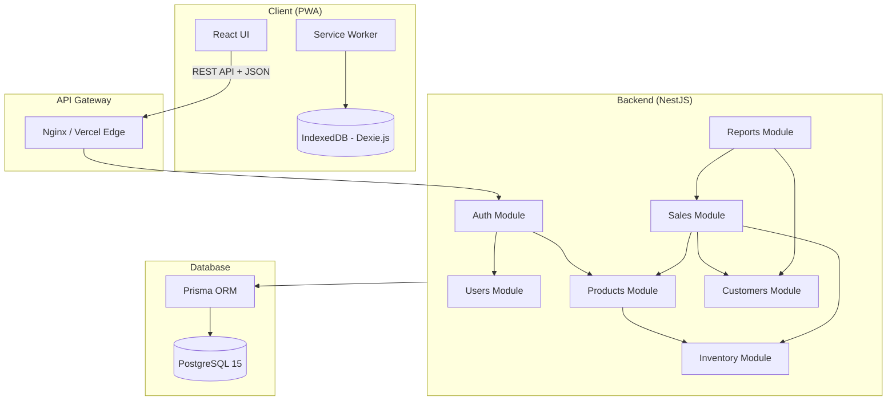
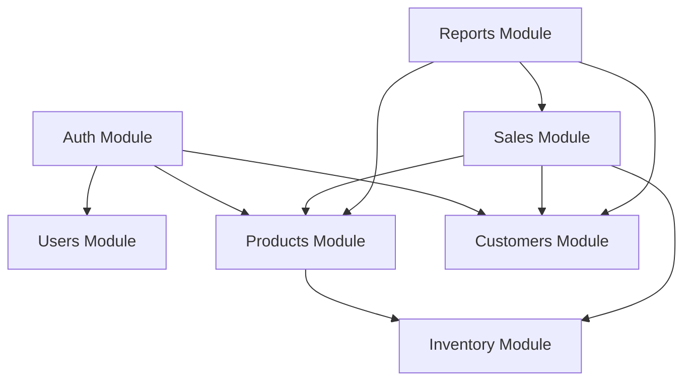
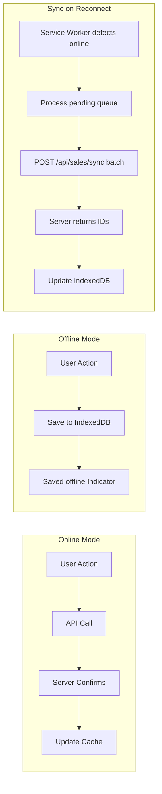
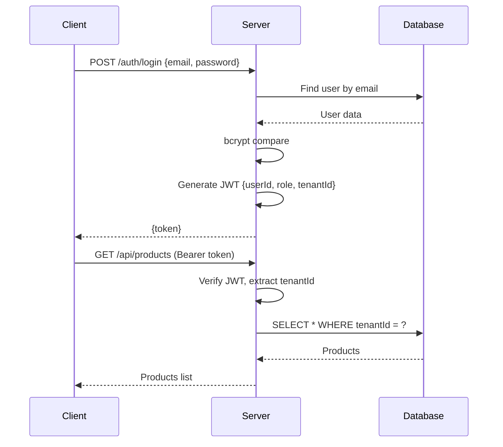
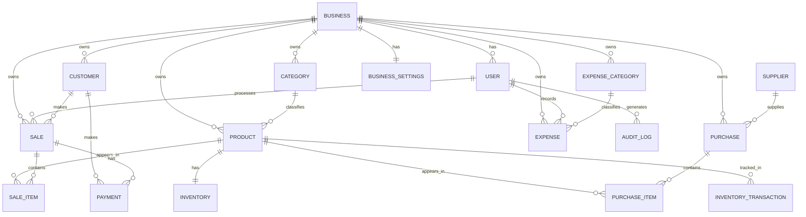
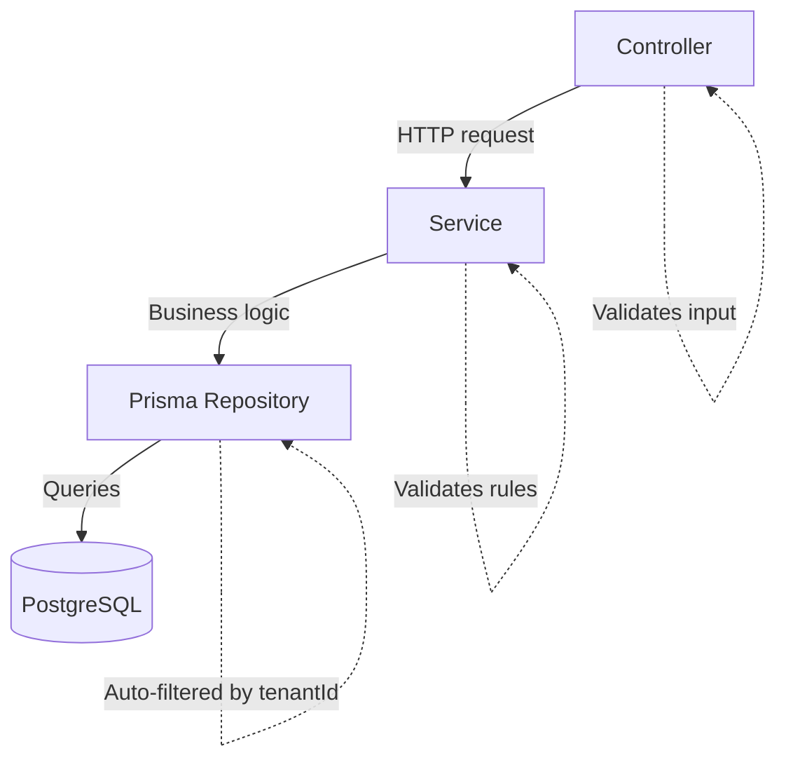
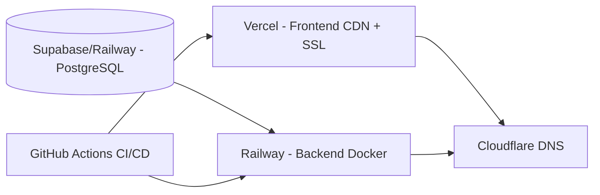

# System Architecture
## SmartBiz ERP Lite

**Style:** Offline-First PWA + Monolithic Backend

---

## High-Level Overview



---

## Tech Stack

| Layer | Tech | Version |
|:------|:-----|:--------|
| **Frontend** | React, TanStack Router, TanStack Query, Zustand, Tailwind, Shadcn UI, Vite, TypeScript | 19.x, 6.x, 3.x, 5.x |
| **Backend** | NestJS, Prisma, PostgreSQL, JWT, bcrypt, class-validator | 10.x, 5.x, 15 |
| **PWA** | Workbox (Service Worker), Dexie.js (IndexedDB) | Latest |
| **Deploy** | Vercel (frontend), Railway (backend), Cloudflare (DNS) | - |

---

## Frontend Structure

```
frontend/src/
├── app/              # Shell, providers, routes, layout
├── components/       # Shared: ui/ (Shadcn), layout/, shared/
├── features/         # Domain-driven modules:
│   ├── auth/         #   pages/, components/, hooks/, api/
│   ├── products/
│   ├── pos/
│   ├── customers/
│   ├── inventory/
│   ├── dashboard/
│   └── settings/
├── lib/              # api.ts, auth.ts, db.ts (IndexedDB), offline.ts
├── hooks/            # useOnlineStatus, useSync
└── types/            # api.ts, models.ts
```

**Key decisions:**
- **TanStack Router** → file-based, type-safe nested layouts
- **TanStack Query** → caching, background refetch, optimistic updates
- **Zustand** → lightweight client state + persistence
- **Dexie.js** → IndexedDB wrapper for offline storage + sync

---

## Backend Structure

```
backend/
├── prisma/           # schema.prisma, seed.ts, migrations/
├── src/
│   ├── common/       # Guards (auth, roles, tenant), decorators, interceptors, filters, pipes
│   ├── modules/
│   │   ├── auth/     # controller, service, JWT strategy, DTOs
│   │   ├── users/
│   │   ├── products/
│   │   ├── inventory/
│   │   ├── customers/
│   │   ├── sales/
│   │   └── reports/
│   └── config/       # environment config
```

---

## Module Dependencies



---

## Offline-First Strategy



- **Static assets:** Precached by Service Worker
- **API:** Network-first, fallback to cache
- **Data:** Products/customers cached in IndexedDB; pending sales queued

---

## API Design

### RESTful Conventions

| Method | Pattern | Example |
|:-------|:--------|:--------|
| GET | `/api/{resource}` | GET `/api/products` |
| GET | `/api/{resource}/:id` | GET `/api/products/abc-123` |
| POST | `/api/{resource}` | POST `/api/products` |
| PUT | `/api/{resource}/:id` | PUT `/api/products/abc-123` |
| DELETE | `/api/{resource}/:id` | DELETE `/api/products/abc-123` |
| POST | `/api/{resource}/{action}` | POST `/api/sales/checkout` |

### Response Format

```json
{ "success": true, "data": {...}, "meta": { "page": 1, "limit": 20, "total": 150 } }
{ "success": false, "error": { "code": "VALIDATION_ERROR", "message": "...", "details": [...] } }
```

### Auth Flow



### Tenant Isolation

Every query auto-filtered by `tenantId` via Prisma middleware:
```typescript
prisma.$use(async (params, next) => {
  if (params.args.where) params.args.where.tenantId = params.context.tenantId;
  return next(params);
});
```

---

## Database Relationships



### Indexing

| Table | Index | Purpose |
|:------|:------|:--------|
| User | `tenantId`, `email` (unique) | Isolation + login |
| Product | `tenantId`, `barcode` | Isolation + scanning |
| Category | `tenantId, name` (unique) | Prevent duplicates |
| Customer | `tenantId` | Isolation |
| Sale | `tenantId`, `createdAt` | Isolation + date queries |
| SaleItem | `saleId` | Sale detail lookups |

---

## Service Layer Pattern



### Key Business Logic

**Sales Checkout:** validate products → validate stock → BEGIN TX → create Sale → create SaleItems → decrement inventory → (if credit) update balance → COMMIT

**Offline Sync:** receive batch → for each: validate products → validate stock → process like checkout → assign server IDs → return offlineId→serverId mapping

---

## Security Layers

| Layer | Implementation |
|:------|:---------------|
| Transport | HTTPS (TLS 1.3) |
| Auth | JWT (24h expiry) |
| Authorization | Role-based guards (RBAC) |
| Tenant Isolation | ORM-level filtering + DB constraints |
| Input Validation | class-validator on all DTOs |
| Passwords | bcrypt (12 salt rounds) |
| Rate Limiting | 100 req/min per user |
| SQL Injection | Prisma parameterized queries |
| XSS | React auto-escaping + CSP headers |

---

## Deployment



**CI/CD:** PR → Lint → Type Check → Test → Build → Deploy

---

## Scalability (MVP → Growth)

| Phase | Change |
|:------|:-------|
| MVP | Monolith + single PostgreSQL + static CDN |
| Growth | Read replicas, extract hot services, Redis cache, BullMQ jobs, Elasticsearch |
