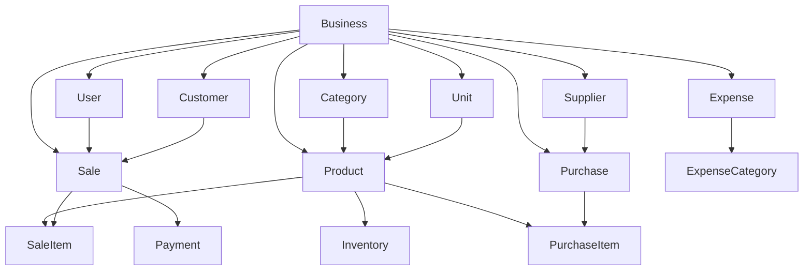

# Domain Analysis
## SmartBiz ERP Lite Database

---

## Business Entities

| Entity | Category | Purpose |
|:-------|:---------|:--------|
| Business | Core | Tenant/organization owning all data |
| User | Core | People operating the system |
| Product | Catalog | Items sold by the business |
| Category | Catalog | Product classification |
| Unit | Catalog | Measurement units (kg, liters, pieces) |
| Supplier | Procurement | Whom the business buys from |
| Purchase | Procurement | Buying goods from suppliers |
| Inventory | Stock | Current stock levels per product |
| Customer | Sales | People who buy from the business |
| Sale | Sales | A transaction with a customer |
| Payment | Finance | Money received or paid |
| Expense | Finance | Business expenses |
| Notification | System | Alerts and messages |
| AuditLog | Security | Change tracking |

---

## Entity Relationships



**Data flow:**
```
Purchase (IN) → Inventory (Stock) → Sale (OUT) → Payment (Money)
     ↓                ↓                ↓              ↓
 Cost Data      Stock Level      Revenue Data    Cash Flow
```

---

## Multi-Tenancy Strategy

| Aspect | Decision | Rationale |
|:-------|:---------|:----------|
| Isolation | `businessId` column on every table | Simplest; sufficient for SME scale |
| Enforcement | ORM middleware (Prisma) + API guards | Application-level; fast |
| Migration | Can move to schema-per-tenant if needed | Flexible upgrade path |
| Data separation | Every query filtered by tenantId | Impossible to leak across tenants |

---

## Relationship Summary

### One-to-One
| Parent | Child | FK | Cascade |
|:-------|:------|:---|:--------|
| Product | Inventory | `productId` | Cascade |
| Business | BusinessSettings | `businessId` | Cascade |

### One-to-Many
| Parent | Child | FK | Cascade |
|:-------|:------|:---|:--------|
| Business | User, Product, Category, Customer, Sale, Purchase, Expense | `businessId` | Cascade |
| Category | Product | `categoryId` | Restrict |
| User | Sale | `cashierId` | Restrict |
| Customer | Sale | `customerId` | Restrict |
| Sale | SaleItem, Payment | `saleId` | Cascade |
| Supplier | Purchase | `supplierId` | Restrict |
| Purchase | PurchaseItem | `purchaseId` | Cascade |
| Product | SaleItem, PurchaseItem | `productId` | Restrict |

### Many-to-Many (through join tables)
| A | B | Through |
|:--|:--|:--------|
| Sale | Product | SaleItem |
| Purchase | Product | PurchaseItem |

### Relationship Rules
| Rule | Why |
|:-----|:----|
| **Cascade Delete** | Tenant deletion removes all data |
| **Restrict Delete** | Prevents orphaned records (can't delete parent if children exist) |
| **Optional FK** | Customer on Sale nullable (walk-in customers) |
| **Required FK** | Sale must have a cashier |

---

## Data Types

| Category | Type | Usage | Why |
|:---------|:-----|:------|:----|
| IDs | UUID | PKs, FKs | Globally unique; works offline; secure |
| Text | VARCHAR(n) | Names, emails | Bounded; index-friendly |
| Text | TEXT | Descriptions, notes | Unbounded |
| Numbers | NUMERIC(12,2) | Money, prices | Exact precision; no float errors |
| Numbers | INTEGER | Quantities | Sufficient range; fast |
| Boolean | BOOLEAN | Flags | Native PostgreSQL |
| Time | TIMESTAMPTZ | Timestamps | Timezone-aware |
| Time | DATE | Expense date | Date-only when time irrelevant |
| JSON | JSONB | Audit log values | Flexible; queryable; compressed |

### UUID vs SERIAL
UUID chosen: globally unique, secure (not guessable), works offline, no coordination needed.

### NUMERIC vs FLOAT
NUMERIC mandatory for money: exact precision (`0.1 + 0.2 = 0.30`), no floating-point rounding errors.
