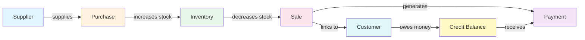
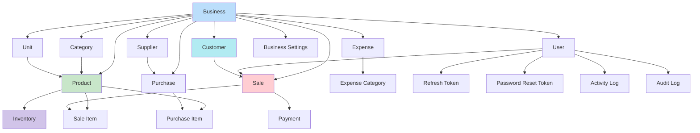

# 04 - ER Diagrams
## SmartBiz ERP Lite Database

---

## Complete ER Diagram

```mermaid
erDiagram
    BUSINESS {
        uuid id PK
        varchar name
        varchar slug UK
        varchar phone
        text address
        varchar currency
        boolean isActive
        timestamp createdAt
        timestamp updatedAt
    }

    USER {
        uuid id PK
        uuid businessId FK
        varchar email UK
        varchar password
        varchar firstName
        varchar lastName
        enum role
        boolean isActive
        timestamp lastLoginAt
        timestamp createdAt
        timestamp updatedAt
        timestamp deletedAt
    }

    CATEGORY {
        uuid id PK
        uuid businessId FK
        varchar name
        text description
        boolean isActive
        timestamp createdAt
        timestamp updatedAt
    }

    UNIT {
        uuid id PK
        uuid businessId FK
        varchar name
        varchar symbol
        boolean isActive
        timestamp createdAt
        timestamp updatedAt
    }

    PRODUCT {
        uuid id PK
        uuid businessId FK
        uuid categoryId FK
        uuid unitId FK
        varchar name
        varchar sku
        varchar barcode
        text description
        decimal baseCost
        decimal overheadCost
        decimal sellingPrice
        boolean isActive
        timestamp createdAt
        timestamp updatedAt
        timestamp deletedAt
    }

    INVENTORY {
        uuid id PK
        uuid productId FK
        int quantity
        int minThreshold
        int maxThreshold
        timestamp createdAt
        timestamp updatedAt
    }

    INVENTORY_TRANSACTION {
        uuid id PK
        uuid businessId FK
        uuid productId FK
        enum type
        int quantity
        int quantityBefore
        int quantityAfter
        uuid referenceId
        varchar referenceType
        text reason
        uuid userId FK
        timestamp createdAt
    }

    SUPPLIER {
        uuid id PK
        uuid businessId FK
        varchar name
        varchar contactName
        varchar phone
        varchar email
        text address
        boolean isActive
        timestamp createdAt
        timestamp updatedAt
    }

    PURCHASE {
        uuid id PK
        uuid businessId FK
        uuid supplierId FK
        varchar invoiceNumber
        decimal subtotal
        decimal taxAmount
        decimal totalAmount
        enum status
        text notes
        timestamp createdAt
        timestamp updatedAt
    }

    PURCHASE_ITEM {
        uuid id PK
        uuid purchaseId FK
        uuid productId FK
        int quantity
        decimal unitCost
        decimal totalCost
    }

    CUSTOMER {
        uuid id PK
        uuid businessId FK
        varchar firstName
        varchar lastName
        varchar phone
        varchar email
        text address
        decimal creditBalance
        decimal creditLimit
        enum status
        text notes
        timestamp createdAt
        timestamp updatedAt
        timestamp deletedAt
    }

    SALE {
        uuid id PK
        uuid businessId FK
        uuid cashierId FK
        uuid customerId FK
        enum paymentMethod
        decimal subtotal
        decimal taxAmount
        decimal discountAmount
        decimal totalAmount
        decimal amountTendered
        decimal changeAmount
        enum status
        text notes
        timestamp createdAt
        timestamp updatedAt
    }

    SALE_ITEM {
        uuid id PK
        uuid saleId FK
        uuid productId FK
        int quantity
        decimal unitPrice
        decimal totalPrice
    }

    PAYMENT {
        uuid id PK
        uuid businessId FK
        uuid saleId FK
        uuid customerId FK
        enum type
        enum method
        decimal amount
        varchar reference
        text notes
        uuid userId FK
        timestamp createdAt
    }

    EXPENSE_CATEGORY {
        uuid id PK
        uuid businessId FK
        varchar name
        boolean isActive
        timestamp createdAt
        timestamp updatedAt
    }

    EXPENSE {
        uuid id PK
        uuid businessId FK
        uuid categoryId FK
        decimal amount
        text description
        date date
        enum paymentMethod
        text receiptUrl
        uuid userId FK
        timestamp createdAt
        timestamp updatedAt
    }

    NOTIFICATION {
        uuid id PK
        uuid businessId FK
        uuid userId FK
        enum type
        varchar title
        text message
        boolean isRead
        varchar link
        timestamp createdAt
    }

    AUDIT_LOG {
        uuid id PK
        uuid businessId FK
        uuid userId FK
        enum action
        varchar entity
        uuid entityId
        jsonb oldValues
        jsonb newValues
        varchar ipAddress
        text userAgent
        timestamp createdAt
    }

    BUSINESS_SETTINGS {
        uuid id PK
        uuid businessId FK
        decimal taxRate
        varchar currency
        varchar currencySymbol
        int lowStockThreshold
        text receiptHeader
        text receiptFooter
        timestamp createdAt
        timestamp updatedAt
    }

    REFRESH_TOKEN {
        uuid id PK
        uuid userId FK
        varchar token UK
        timestamp expiresAt
        timestamp createdAt
    }

    PASSWORD_RESET_TOKEN {
        uuid id PK
        uuid userId FK
        varchar token UK
        timestamp expiresAt
        timestamp usedAt
        timestamp createdAt
    }

    ACTIVITY_LOG {
        uuid id PK
        uuid userId FK
        varchar action
        text description
        varchar ipAddress
        text userAgent
        timestamp createdAt
    }

    BUSINESS ||--o{ USER : "has"
    BUSINESS ||--o{ PRODUCT : "owns"
    BUSINESS ||--o{ CATEGORY : "owns"
    BUSINESS ||--o{ UNIT : "owns"
    BUSINESS ||--o{ SUPPLIER : "owns"
    BUSINESS ||--o{ CUSTOMER : "owns"
    BUSINESS ||--o{ SALE : "owns"
    BUSINESS ||--o{ PURCHASE : "owns"
    BUSINESS ||--o{ EXPENSE : "owns"
    BUSINESS ||--o{ EXPENSE_CATEGORY : "owns"
    BUSINESS ||--o{ NOTIFICATION : "owns"
    BUSINESS ||--o{ AUDIT_LOG : "owns"
    BUSINESS ||--|| BUSINESS_SETTINGS : "has"

    CATEGORY ||--o{ PRODUCT : "classifies"
    UNIT ||--o{ PRODUCT : "measures"
    PRODUCT ||--|| INVENTORY : "has"
    PRODUCT ||--o{ SALE_ITEM : "appears in"
    PRODUCT ||--o{ PURCHASE_ITEM : "appears in"
    PRODUCT ||--o{ INVENTORY_TRANSACTION : "tracked in"

    USER ||--o{ SALE : "processes"
    USER ||--o{ EXPENSE : "records"
    USER ||--o{ AUDIT_LOG : "generates"
    USER ||--o{ ACTIVITY_LOG : "generates"
    USER ||--o{ REFRESH_TOKEN : "has"
    USER ||--o{ PASSWORD_RESET_TOKEN : "has"

    CUSTOMER ||--o{ SALE : "makes"
    CUSTOMER ||--o{ PAYMENT : "makes"

    SALE ||--o{ SALE_ITEM : "contains"
    SALE ||--o{ PAYMENT : "has"

    SUPPLIER ||--o{ PURCHASE : "supplies"
    PURCHASE ||--o{ PURCHASE_ITEM : "contains"

    EXPENSE_CATEGORY ||--o{ EXPENSE : "classifies"
```

---

## Data Flow Diagram

```mermaid
graph LR
    A[Supplier] -->|supplies| B[Purchase]
    B -->|increases stock| C[Inventory]
    C -->|decreases stock| D[Sale]
    D -->|generates| E[Payment]
    D -->|links to| F[Customer]
    F -->|owes money| G[Credit Balance]
    G -->|receives| E

    style A fill:#e1f5fe
    style B fill:#fff3e0
    style C fill:#e8f5e9
    style D fill:#fce4ec
    style E fill:#f3e5f5
    style F fill:#e0f7fa
    style G fill:#fff9c4
```

---

## Relationship Map

```mermaid
graph TD
    BIZ[Business] --> U[User]
    BIZ --> P[Product]
    BIZ --> CAT[Category]
    BIZ --> UNIT[Unit]
    BIZ --> SUP[Supplier]
    BIZ --> CUST[Customer]
    BIZ --> S[Sale]
    BIZ --> PUR[Purchase]
    BIZ --> EXP[Expense]
    BIZ --> BIZSET[Business Settings]

    CAT --> P
    UNIT --> P
    P --> INV[Inventory]
    P --> SI[Sale Item]
    P --> PI[Purchase Item]

    U --> S
    CUST --> S
    S --> SI
    S --> PAY[Payment]

    SUP --> PUR
    PUR --> PI

    EXP --> EXPCAT[Expense Category]

    U --> RT[Refresh Token]
    U --> PRT[Password Reset Token]
    U --> AL[Activity Log]
    U --> AUD[Audit Log]

    style BIZ fill:#bbdefb
    style P fill:#c8e6c9
    style S fill:#ffcdd2
    style INV fill:#d1c4e9
    style CUST fill:#b2ebf2
```
