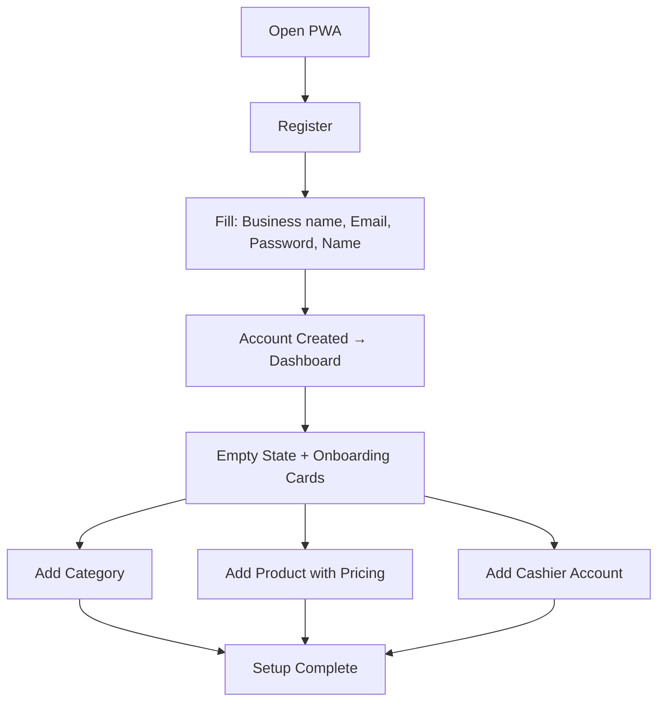
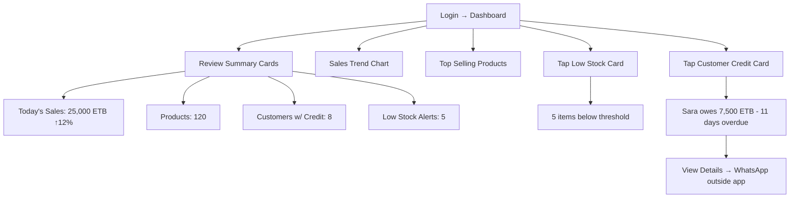
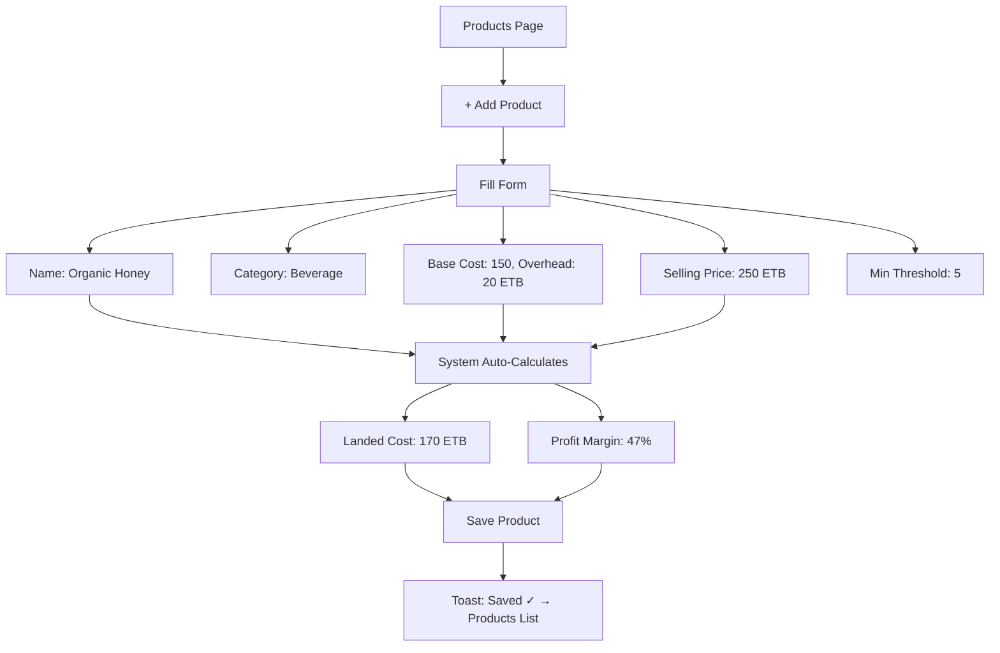
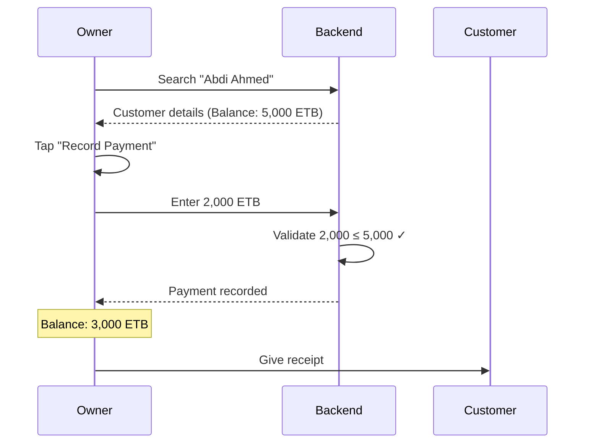
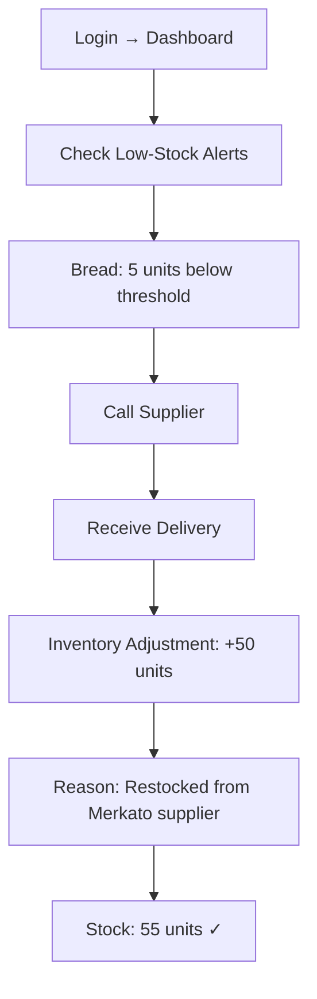
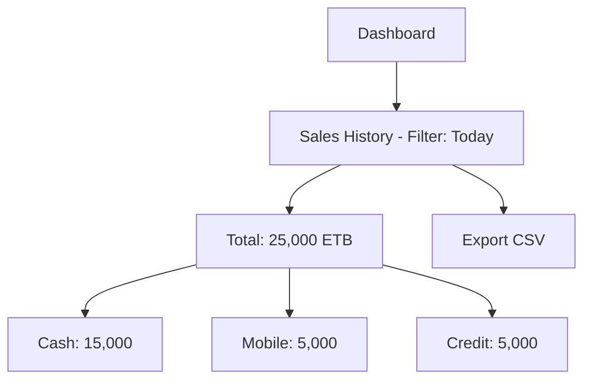
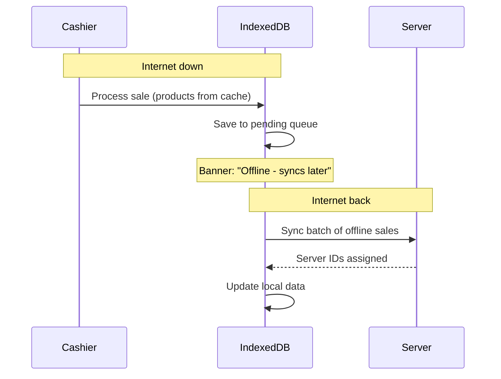

# User Journeys
## SmartBiz ERP Lite

---

## 1. Owner Journeys

### 1.1 First-Time Setup



### 1.2 Daily Monitoring



### 1.3 Product Management



### 1.4 Credit Payment



---

## 2. Manager Journeys

### 2.1 Morning Opening + Restock



### 2.2 Credit Sale

```mermaid
graph TD
    A[Open POS] --> B[Search + Add Items to Cart]
    B --> C[Cart Total: 500 ETB]
    C --> D[Select "Credit" Payment]
    D --> E[Search Customer: Tesfaye D.]
    E --> F[Current Balance: 2,500 ETB]
    F --> G[Confirm Sale]
    G --> H[POST /api/sales/checkout]
    H --> I[Sale Recorded + Inventory Decremented]
    I --> J[Customer Balance: 3,000 ETB]
```

### 2.3 End-of-Day



---

## 3. Cashier Journeys

### 3.1 Quick Cash Sale

```mermaid
graph TD
    A[POS - Default Screen] --> B[Search "milk" → Add x2]
    B --> C[Search "bread" → Add x1]
    C --> D[Cart: Milk 90 + Bread 25 = 115 ETB]
    D --> E[Select Cash]
    E --> F[Customer gives 150 ETB]
    F --> G[Change: 35 ETB]
    G --> H[Complete Sale ✓]
```

### 3.2 Offline Sale



### 3.3 Credit Sale + New Customer

```mermaid
graph TD
    A[Process Items in Cart] --> B[Select "Credit"]
    B --> C{Customer exists?}
    C -->|Yes| D[Search + Select Customer]
    C -->|No| E[Tap "New Customer"]
    E --> F[Modal: Name, Phone]
    F --> G[Create Customer]
    G --> D
    D --> H[Confirm Sale]
    H --> I[Balance updated]
```
