# Database Architecture & Design
## SmartBiz ERP Lite

**Version:** 2.0
**Date:** August 2026
**Author:** Principal Database Architect
**Status:** Production-Ready Design

---

## Table of Contents

1. [Business Domain Analysis](#1-business-domain-analysis)
2. [Entity Identification](#2-entity-identification)
3. [Database Relationships](#3-database-relationships)
4. [Table Design](#4-table-design)
5. [Data Types](#5-data-types)
6. [ENUM Design](#6-enum-design)
7. [Prisma Schema](#7-prisma-schema)
8. [Database Constraints](#8-database-constraints)
9. [Indexing Strategy](#9-indexing-strategy)
10. [Query Optimization](#10-query-optimization)
11. [Audit & Security](#11-audit--security)
12. [Backup & Recovery](#12-backup--recovery)
13. [ER Diagram](#13-er-diagram)
14. [Database Documentation](#14-database-documentation)

---

# 1. Business Domain Analysis

## 1.1 Business Entities

SmartBiz ERP Lite operates in the **retail domain** for Ethiopian SMEs. The core business entities are:

| Entity | Category | Description |
|:-------|:---------|:------------|
| **Business** | Core | The tenant/organization owning all data |
| **User** | Core | People who interact with the system |
| **Product** | Catalog | Items sold by the business |
| **Category** | Catalog | Product classification |
| **Unit** | Catalog | Measurement units (kg, liters, pieces) |
| **Supplier** | Procurement | Whom the business buys from |
| **Purchase** | Procurement | Buying goods from suppliers |
| **Inventory** | Stock | Current stock levels per product |
| **Customer** | Sales | People who buy from the business |
| **Sale** | Sales | A transaction with a customer |
| **Payment** | Finance | Money received or paid |
| **Expense** | Finance | Business expenses |
| **Notification** | System | Alerts and messages |
| **AuditLog** | Security | Change tracking |

## 1.2 Relationships

```
Business ──┬── owns ──► Users (many)
           ├── owns ──► Products (many)
           ├── owns ──► Categories (many)
           ├── owns ──► Units (many)
           ├── owns ──► Suppliers (many)
           ├── owns ──► Customers (many)
           ├── owns ──► Purchases (many)
           ├── owns ──► Sales (many)
           ├── owns ──► Expenses (many)
           └── owns ──► Inventory (many)

Product ──┬── belongs_to ──► Category (one)
          ├── has_one ──► Inventory (one)
          ├── appears_in ──► SaleItem (many)
          └── appears_in ──► PurchaseItem (many)

Sale ──┬── belongs_to ──► User/Cashier (one)
       ├── belongs_to ──► Customer (one, optional)
       ├── has_many ──► SaleItem (many)
       └── has_many ──► Payment (many)

Customer ──┬── has_many ──► Sales (many)
           └── has_many ──► Payment (many)

Purchase ──┬── belongs_to ──► Supplier (one)
           └── has_many ──► PurchaseItem (many)
```

## 1.3 Data Flow

```
┌──────────┐     ┌──────────┐     ┌──────────┐     ┌──────────┐
│ Purchase │────►│Inventory │────►│  Sale    │────►│ Payment  │
│ (IN)     │     │ (Stock)  │     │ (OUT)    │     │ (Money)  │
└──────────┘     └──────────┘     └──────────┘     └──────────┘
      │                │                │                │
      ▼                ▼                ▼                ▼
  Cost Data      Stock Level      Revenue Data     Cash Flow
```

## 1.4 Ownership

Every piece of data belongs to a **Business (Tenant)**. This is the foundation of multi-tenancy.

| Data | Owner | Isolation |
|:-----|:------|:----------|
| Products | Business | tenantId filter |
| Sales | Business | tenantId filter |
| Customers | Business | tenantId filter |
| Users | Business | tenantId filter |
| Inventory | Business | tenantId filter |
| Expenses | Business | tenantId filter |

## 1.5 Multi-Tenancy Strategy

**Approach: Shared Database, Shared Schema, tenantId column**

| Aspect | Decision | Rationale |
|:-------|:---------|:----------|
| **Isolation method** | `tenantId` column on every table | Simplest to implement; sufficient for SME scale |
| **Enforcement** | ORM middleware (Prisma) + API guards | Application-level enforcement; fast |
| **Future migration** | Can move to schema-per-tenant if needed | Flexible upgrade path |
| **Data separation** | Every query filtered by tenantId | Impossible to leak data across tenants |

---

# 2. Entity Identification

## 2.1 Core Entities

### Business (Tenant)
**Why exists:** The top-level entity. Every other entity belongs to a business. This is the multi-tenancy boundary.

### User
**Why exists:** People who operate the system. Each user has a role (Owner, Manager, Cashier) determining their permissions.

### Role / Permission
**Why exists:** Controls what users can access. Not a separate table — roles are ENUM values on the User table. Permissions are enforced in code, not in the database.

## 2.2 Catalog Entities

### Product
**Why exists:** The core data entity. Products are what the business sells. Every sale, inventory movement, and pricing decision revolves around products.

### Category
**Why exists:** Organizes products into groups. Enables filtering, reporting, and bulk operations. A product MUST belong to a category.

### Unit
**Why exists:** Defines how products are measured (pieces, kg, liters). Prevents ambiguity in inventory and sales quantities.

### Brand
**Why exists:** Optional product attribute. Useful for filtering and reporting. Not required for MVP but included for future expansion.

## 2.3 Procurement Entities

### Supplier
**Why exists:** Tracks whom the business buys from. Enables purchase history, supplier performance analysis, and reorder management.

### Purchase
**Why exists:** Records when the business buys goods from suppliers. Increases inventory. Tracks cost data for profit calculations.

### PurchaseItem
**Why exists:** Line items within a purchase. A purchase can contain multiple products. Tracks quantity and unit cost per product.

## 2.4 Inventory Entities

### Inventory
**Why exists:** Current stock level per product. One-to-one with Product. Updated on every sale and purchase.

### InventoryTransaction
**Why exists:** Complete history of every stock movement. Enables audit trails, stock reconciliation, and discrepancy investigation.

## 2.5 Sales Entities

### Customer
**Why exists:** People who buy from the business. Enables credit tracking, purchase history, and customer relationship management.

### Sale
**Why exists:** A transaction record. Captures what was sold, when, to whom, and how payment was made. The core revenue record.

### SaleItem
**Why exists:** Line items within a sale. A sale can contain multiple products. Records quantity and price at time of sale.

## 2.6 Finance Entities

### Payment
**Why exists:** Tracks money received (from customers) or paid (to suppliers). Enables cash flow tracking and reconciliation.

### Expense
**Why exists:** Records business expenses (rent, utilities, salaries). Enables profit calculation (revenue - cost of goods - expenses).

### ExpenseCategory
**Why exists:** Classifies expenses (Rent, Utilities, Salaries, Transport). Enables expense reporting and budgeting.

## 2.7 System Entities

### Notification
**Why exists:** System alerts (low stock, sync status, credit reminders). Enables proactive business management.

### AuditLog
**Why exists:** Tracks who changed what and when. Critical for security, debugging, and compliance.

### RefreshToken
**Why exists:** Enables long-lived sessions without re-login. JWT access tokens are short-lived; refresh tokens renew them.

### PasswordResetToken
**Why exists:** Enables password reset via email. Time-limited, single-use tokens.

### ActivityLog
**Why exists:** Records user actions (login, logout, sale processed). Enables activity monitoring and anomaly detection.

---

# 3. Database Relationships

## 3.1 One-to-One Relationships

| Parent | Child | Foreign Key | Cascade |
|:-------|:------|:------------|:--------|
| Product | Inventory | `inventory.productId` | Cascade delete |
| Business | BusinessSettings | `businessSettings.businessId` | Cascade delete |

**Why:** Each product has exactly one inventory record. Each business has one settings record.

## 3.2 One-to-Many Relationships

| Parent | Child | Foreign Key | Cascade |
|:-------|:------|:------------|:--------|
| Business | User | `user.businessId` | Cascade delete |
| Business | Product | `product.businessId` | Cascade delete |
| Business | Category | `category.businessId` | Cascade delete |
| Business | Customer | `customer.businessId` | Cascade delete |
| Business | Sale | `sale.businessId` | Cascade delete |
| Business | Purchase | `purchase.businessId` | Cascade delete |
| Business | Expense | `expense.businessId` | Cascade delete |
| Category | Product | `product.categoryId` | Restrict |
| User | Sale | `sale.cashierId` | Restrict |
| Customer | Sale | `sale.customerId` | Restrict |
| Sale | SaleItem | `saleItem.saleId` | Cascade delete |
| Sale | Payment | `payment.saleId` | Cascade delete |
| Supplier | Purchase | `purchase.supplierId` | Restrict |
| Purchase | PurchaseItem | `purchaseItem.purchaseId` | Cascade delete |
| Product | SaleItem | `saleItem.productId` | Restrict |
| Product | PurchaseItem | `purchaseItem.productId` | Restrict |

## 3.3 Many-to-Many Relationships

| Entity A | Entity B | Through Table | Notes |
|:---------|:---------|:--------------|:------|
| Sale | Product | SaleItem | A sale has many products; a product appears in many sales |
| Purchase | Product | PurchaseItem | A purchase has many products; a product appears in many purchases |

## 3.4 Relationship Rules

| Rule | Implementation | Why |
|:-----|:---------------|:----|
| **Cascade Delete** | Child deleted when parent deleted | Tenant deletion removes all data |
| **Restrict Delete** | Cannot delete parent if children exist | Prevents orphaned records |
| **Optional Relation** | Foreign key nullable | Customer on Sale is optional (walk-in) |
| **Required Relation** | Foreign key not null | Sale must have a cashier |

---

# 4. Table Design

## 4.1 Business Table

**Purpose:** The tenant/organization. Top-level entity.

| Column | Type | Nullable | Default | Description |
|:-------|:-----|:---------|:--------|:------------|
| `id` | UUID | No | `gen_random_uuid()` | Primary key |
| `name` | VARCHAR(200) | No | — | Business name |
| `slug` | VARCHAR(200) | No | — | URL-friendly identifier |
| `phone` | VARCHAR(20) | Yes | — | Business phone |
| `address` | TEXT | Yes | — | Business address |
| `currency` | VARCHAR(3) | No | `'ETB'` | ISO currency code |
| `isActive` | BOOLEAN | No | `true` | Account status |
| `createdAt` | TIMESTAMPTZ | No | `now()` | Creation timestamp |
| `updatedAt` | TIMESTAMPTZ | No | `now()` | Last update timestamp |

**Indexes:**
- `id` (primary key)
- `slug` (unique)

## 4.2 User Table

**Purpose:** People who operate the system.

| Column | Type | Nullable | Default | Description |
|:-------|:-----|:---------|:--------|:------------|
| `id` | UUID | No | `gen_random_uuid()` | Primary key |
| `businessId` | UUID | No | — | FK → Business |
| `email` | VARCHAR(255) | No | — | Login email |
| `password` | VARCHAR(255) | No | — | bcrypt hash |
| `firstName` | VARCHAR(100) | No | — | First name |
| `lastName` | VARCHAR(100) | No | — | Last name |
| `role` | ENUM | No | `'CASHIER'` | OWNER, MANAGER, CASHIER |
| `isActive` | BOOLEAN | No | `true` | Account status |
| `lastLoginAt` | TIMESTAMPTZ | Yes | — | Last login time |
| `createdAt` | TIMESTAMPTZ | No | `now()` | Creation timestamp |
| `updatedAt` | TIMESTAMPTZ | No | `now()` | Last update timestamp |
| `deletedAt` | TIMESTAMPTZ | Yes | — | Soft delete timestamp |

**Indexes:**
- `id` (primary key)
- `businessId` (tenant isolation)
- `email` (unique — login lookup)
- `businessId, role` (user management)

**Constraints:**
- Email unique globally
- Email format validation
- Password minimum 8 characters

## 4.3 Category Table

**Purpose:** Product classification.

| Column | Type | Nullable | Default | Description |
|:-------|:-----|:---------|:--------|:------------|
| `id` | UUID | No | `gen_random_uuid()` | Primary key |
| `businessId` | UUID | No | — | FK → Business |
| `name` | VARCHAR(100) | No | — | Category name |
| `description` | TEXT | Yes | — | Optional description |
| `isActive` | BOOLEAN | No | `true` | Active status |
| `createdAt` | TIMESTAMPTZ | No | `now()` | Creation timestamp |
| `updatedAt` | TIMESTAMPTZ | No | `now()` | Last update timestamp |

**Indexes:**
- `id` (primary key)
- `businessId` (tenant isolation)
- `businessId, name` (unique — prevent duplicate names per tenant)

## 4.4 Unit Table

**Purpose:** Measurement units.

| Column | Type | Nullable | Default | Description |
|:-------|:-----|:---------|:--------|:------------|
| `id` | UUID | No | `gen_random_uuid()` | Primary key |
| `businessId` | UUID | No | — | FK → Business |
| `name` | VARCHAR(50) | No | — | Unit name (Kilogram) |
| `symbol` | VARCHAR(10) | No | — | Unit symbol (kg) |
| `isActive` | BOOLEAN | No | `true` | Active status |
| `createdAt` | TIMESTAMPTZ | No | `now()` | Creation timestamp |
| `updatedAt` | TIMESTAMPTZ | No | `now()` | Last update timestamp |

**Indexes:**
- `id` (primary key)
- `businessId` (tenant isolation)
- `businessId, symbol` (unique — prevent duplicate symbols per tenant)

## 4.5 Product Table

**Purpose:** Items sold by the business.

| Column | Type | Nullable | Default | Description |
|:-------|:-----|:---------|:--------|:------------|
| `id` | UUID | No | `gen_random_uuid()` | Primary key |
| `businessId` | UUID | No | — | FK → Business |
| `categoryId` | UUID | Yes | — | FK → Category |
| `unitId` | UUID | Yes | — | FK → Unit |
| `name` | VARCHAR(200) | No | — | Product name |
| `sku` | VARCHAR(50) | Yes | — | Stock keeping unit |
| `barcode` | VARCHAR(100) | Yes | — | Barcode number |
| `description` | TEXT | Yes | — | Product description |
| `baseCost` | NUMERIC(12,2) | No | `0` | Raw cost of item |
| `overheadCost` | NUMERIC(12,2) | No | `0` | Transport, tax, etc. |
| `sellingPrice` | NUMERIC(12,2) | No | `0` | Selling price |
| `isActive` | BOOLEAN | No | `true` | Active status |
| `createdAt` | TIMESTAMPTZ | No | `now()` | Creation timestamp |
| `updatedAt` | TIMESTAMPTZ | No | `now()` | Last update timestamp |
| `deletedAt` | TIMESTAMPTZ | Yes | — | Soft delete timestamp |

**Computed Column (not stored):**
- `landedCost` = `baseCost + overheadCost` (calculated in application layer)

**Indexes:**
- `id` (primary key)
- `businessId` (tenant isolation)
- `businessId, barcode` (barcode scanning)
- `businessId, sku` (SKU lookup)
- `businessId, categoryId` (category filtering)
- `businessId, name` (text search)
- `isActive` (active products only)

**Constraints:**
- `baseCost >= 0`
- `overheadCost >= 0`
- `sellingPrice >= 0`
- SKU unique per business (when provided)
- Barcode unique per business (when provided)

## 4.6 Supplier Table

**Purpose:** Whom the business buys from.

| Column | Type | Nullable | Default | Description |
|:-------|:-----|:---------|:--------|:------------|
| `id` | UUID | No | `gen_random_uuid()` | Primary key |
| `businessId` | UUID | No | — | FK → Business |
| `name` | VARCHAR(200) | No | — | Supplier name |
| `contactName` | VARCHAR(200) | Yes | — | Contact person |
| `phone` | VARCHAR(20) | Yes | — | Phone number |
| `email` | VARCHAR(255) | Yes | — | Email address |
| `address` | TEXT | Yes | — | Physical address |
| `isActive` | BOOLEAN | No | `true` | Active status |
| `createdAt` | TIMESTAMPTZ | No | `now()` | Creation timestamp |
| `updatedAt` | TIMESTAMPTZ | No | `now()` | Last update timestamp |

**Indexes:**
- `id` (primary key)
- `businessId` (tenant isolation)
- `businessId, name` (search)

## 4.7 Inventory Table

**Purpose:** Current stock level per product.

| Column | Type | Nullable | Default | Description |
|:-------|:-----|:---------|:--------|:------------|
| `id` | UUID | No | `gen_random_uuid()` | Primary key |
| `productId` | UUID | No | — | FK → Product (unique) |
| `quantity` | INTEGER | No | `0` | Current stock quantity |
| `minThreshold` | INTEGER | No | `5` | Low stock alert threshold |
| `maxThreshold` | INTEGER | Yes | — | Optional max level |
| `createdAt` | TIMESTAMPTZ | No | `now()` | Creation timestamp |
| `updatedAt` | TIMESTAMPTZ | No | `now()` | Last update timestamp |

**Indexes:**
- `id` (primary key)
- `productId` (unique — one inventory per product)
- `quantity` (low stock queries)

**Constraints:**
- `quantity >= 0` (cannot go negative)
- `minThreshold >= 0`

## 4.8 InventoryTransaction Table

**Purpose:** Complete history of every stock movement.

| Column | Type | Nullable | Default | Description |
|:-------|:-----|:---------|:--------|:------------|
| `id` | UUID | No | `gen_random_uuid()` | Primary key |
| `businessId` | UUID | No | — | FK → Business |
| `productId` | UUID | No | — | FK → Product |
| `type` | ENUM | No | — | SALE, PURCHASE, ADJUSTMENT, RETURN |
| `quantity` | INTEGER | No | — | Positive = in, Negative = out |
| `quantityBefore` | INTEGER | No | — | Stock before movement |
| `quantityAfter` | INTEGER | No | — | Stock after movement |
| `referenceId` | UUID | Yes | — | Sale ID or Purchase ID |
| `referenceType` | VARCHAR(20) | Yes | — | 'SALE' or 'PURCHASE' or 'ADJUSTMENT' |
| `reason` | TEXT | Yes | — | Reason for adjustment |
| `userId` | UUID | No | — | FK → User (who made the change) |
| `createdAt` | TIMESTAMPTZ | No | `now()` | Creation timestamp |

**Indexes:**
- `id` (primary key)
- `businessId` (tenant isolation)
- `productId` (product history)
- `businessId, createdAt` (date range queries)
- `referenceType, referenceId` (lookup by sale/purchase)

## 4.9 Customer Table

**Purpose:** People who buy from the business.

| Column | Type | Nullable | Default | Description |
|:-------|:-----|:---------|:--------|:------------|
| `id` | UUID | No | `gen_random_uuid()` | Primary key |
| `businessId` | UUID | No | — | FK → Business |
| `firstName` | VARCHAR(100) | No | — | First name |
| `lastName` | VARCHAR(100) | Yes | — | Last name |
| `phone` | VARCHAR(20) | Yes | — | Phone number |
| `email` | VARCHAR(255) | Yes | — | Email address |
| `address` | TEXT | Yes | — | Physical address |
| `creditBalance` | NUMERIC(12,2) | No | `0` | Outstanding debt |
| `creditLimit` | NUMERIC(12,2) | Yes | — | Max credit allowed |
| `status` | ENUM | No | `'ACTIVE'` | ACTIVE, INACTIVE, BLOCKED |
| `notes` | TEXT | Yes | — | Internal notes |
| `createdAt` | TIMESTAMPTZ | No | `now()` | Creation timestamp |
| `updatedAt` | TIMESTAMPTZ | No | `now()` | Last update timestamp |
| `deletedAt` | TIMESTAMPTZ | Yes | — | Soft delete timestamp |

**Indexes:**
- `id` (primary key)
- `businessId` (tenant isolation)
- `businessId, phone` (phone lookup)
- `businessId, firstName` (name search)
- `creditBalance` (debt reports — only non-zero balances)

**Constraints:**
- `creditBalance >= 0`
- `creditLimit >= 0` (when provided)
- Phone format validation

## 4.10 Sale Table

**Purpose:** A transaction record.

| Column | Type | Nullable | Default | Description |
|:-------|:-----|:---------|:--------|:------------|
| `id` | UUID | No | `gen_random_uuid()` | Primary key |
| `businessId` | UUID | No | — | FK → Business |
| `cashierId` | UUID | No | — | FK → User |
| `customerId` | UUID | Yes | — | FK → Customer (optional) |
| `paymentMethod` | ENUM | No | — | CASH, MOBILE_MONEY, CREDIT |
| `subtotal` | NUMERIC(12,2) | No | — | Sum of item totals |
| `taxAmount` | NUMERIC(12,2) | No | `0` | Tax amount |
| `discountAmount` | NUMERIC(12,2) | No | `0` | Discount amount |
| `totalAmount` | NUMERIC(12,2) | No | — | Final amount |
| `amountTendered` | NUMERIC(12,2) | Yes | — | Cash given (for cash sales) |
| `changeAmount` | NUMERIC(12,2) | Yes | — | Change returned |
| `status` | ENUM | No | `'COMPLETED'` | COMPLETED, VOIDED, REFUNDED |
| `notes` | TEXT | Yes | — | Sale notes |
| `createdAt` | TIMESTAMPTZ | No | `now()` | Sale timestamp |
| `updatedAt` | TIMESTAMPTZ | No | `now()` | Last update timestamp |

**Indexes:**
- `id` (primary key)
- `businessId` (tenant isolation)
- `businessId, createdAt` (date range queries, reports)
- `cashierId` (cashier-specific queries)
- `customerId` (customer purchase history)
- `businessId, status` (voided/refunded sales)
- `businessId, paymentMethod` (payment method reports)

**Constraints:**
- `totalAmount > 0`
- `subtotal >= 0`
- `taxAmount >= 0`
- `discountAmount >= 0`
- `amountTendered >= totalAmount` (for cash sales)
- `changeAmount >= 0`
- `customerId required when paymentMethod = 'CREDIT'`

## 4.11 SaleItem Table

**Purpose:** Line items within a sale.

| Column | Type | Nullable | Default | Description |
|:-------|:-----|:---------|:--------|:------------|
| `id` | UUID | No | `gen_random_uuid()` | Primary key |
| `saleId` | UUID | No | — | FK → Sale |
| `productId` | UUID | No | — | FK → Product |
| `quantity` | INTEGER | No | — | Quantity sold |
| `unitPrice` | NUMERIC(12,2) | No | — | Price at time of sale |
| `totalPrice` | NUMERIC(12,2) | No | — | quantity × unitPrice |

**Indexes:**
- `id` (primary key)
- `saleId` (sale detail queries)
- `productId` (product sales history)

**Constraints:**
- `quantity > 0`
- `unitPrice >= 0`
- `totalPrice = quantity * unitPrice`

## 4.12 Purchase Table

**Purpose:** Records when the business buys goods from suppliers.

| Column | Type | Nullable | Default | Description |
|:-------|:-----|:---------|:--------|:------------|
| `id` | UUID | No | `gen_random_uuid()` | Primary key |
| `businessId` | UUID | No | — | FK → Business |
| `supplierId` | UUID | Yes | — | FK → Supplier |
| `invoiceNumber` | VARCHAR(50) | Yes | — | Supplier's invoice # |
| `subtotal` | NUMERIC(12,2) | No | — | Sum of item totals |
| `taxAmount` | NUMERIC(12,2) | No | `0` | Tax amount |
| `totalAmount` | NUMERIC(12,2) | No | — | Final amount |
| `status` | ENUM | No | `'RECEIVED'` | PENDING, RECEIVED, CANCELLED |
| `notes` | TEXT | Yes | — | Purchase notes |
| `createdAt` | TIMESTAMPTZ | No | `now()` | Purchase timestamp |
| `updatedAt` | TIMESTAMPTZ | No | `now()` | Last update timestamp |

**Indexes:**
- `id` (primary key)
- `businessId` (tenant isolation)
- `supplierId` (supplier purchase history)
- `businessId, createdAt` (date range queries)

## 4.13 PurchaseItem Table

**Purpose:** Line items within a purchase.

| Column | Type | Nullable | Default | Description |
|:-------|:-----|:---------|:--------|:------------|
| `id` | UUID | No | `gen_random_uuid()` | Primary key |
| `purchaseId` | UUID | No | — | FK → Purchase |
| `productId` | UUID | No | — | FK → Product |
| `quantity` | INTEGER | No | — | Quantity purchased |
| `unitCost` | NUMERIC(12,2) | No | — | Cost per unit |
| `totalCost` | NUMERIC(12,2) | No | — | quantity × unitCost |

**Indexes:**
- `id` (primary key)
- `purchaseId` (purchase detail queries)
- `productId` (product purchase history)

## 4.14 Payment Table

**Purpose:** Tracks money received or paid.

| Column | Type | Nullable | Default | Description |
|:-------|:-----|:---------|:--------|:------------|
| `id` | UUID | No | `gen_random_uuid()` | Primary key |
| `businessId` | UUID | No | — | FK → Business |
| `saleId` | UUID | Yes | — | FK → Sale |
| `customerId` | UUID | Yes | — | FK → Customer |
| `type` | ENUM | No | — | INCOMING, OUTGOING |
| `method` | ENUM | No | — | CASH, MOBILE_MONEY, BANK_TRANSFER |
| `amount` | NUMERIC(12,2) | No | — | Payment amount |
| `reference` | VARCHAR(100) | Yes | — | Transaction reference |
| `notes` | TEXT | Yes | — | Payment notes |
| `userId` | UUID | No | — | FK → User (who recorded) |
| `createdAt` | TIMESTAMPTZ | No | `now()` | Payment timestamp |

**Indexes:**
- `id` (primary key)
- `businessId` (tenant isolation)
- `customerId` (customer payment history)
- `saleId` (sale payment lookup)
- `businessId, createdAt` (date range queries)
- `businessId, type` (incoming vs outgoing)

## 4.15 Expense Table

**Purpose:** Business expenses.

| Column | Type | Nullable | Default | Description |
|:-------|:-----|:---------|:--------|:------------|
| `id` | UUID | No | `gen_random_uuid()` | Primary key |
| `businessId` | UUID | No | — | FK → Business |
| `categoryId` | UUID | No | — | FK → ExpenseCategory |
| `amount` | NUMERIC(12,2) | No | — | Expense amount |
| `description` | TEXT | No | — | What the expense was for |
| `date` | DATE | No | `CURRENT_DATE` | Expense date |
| `paymentMethod` | ENUM | No | `'CASH'` | How it was paid |
| `receiptUrl` | TEXT | Yes | — | Receipt image URL |
| `userId` | UUID | No | — | FK → User (who recorded) |
| `createdAt` | TIMESTAMPTZ | No | `now()` | Creation timestamp |
| `updatedAt` | TIMESTAMPTZ | No | `now()` | Last update timestamp |

**Indexes:**
- `id` (primary key)
- `businessId` (tenant isolation)
- `businessId, date` (date range queries)
- `businessId, categoryId` (category reports)

## 4.16 ExpenseCategory Table

**Purpose:** Classifies expenses.

| Column | Type | Nullable | Default | Description |
|:-------|:-----|:---------|:--------|:------------|
| `id` | UUID | No | `gen_random_uuid()` | Primary key |
| `businessId` | UUID | No | — | FK → Business |
| `name` | VARCHAR(100) | No | — | Category name |
| `isActive` | BOOLEAN | No | `true` | Active status |
| `createdAt` | TIMESTAMPTZ | No | `now()` | Creation timestamp |
| `updatedAt` | TIMESTAMPTZ | No | `now()` | Last update timestamp |

**Indexes:**
- `id` (primary key)
- `businessId` (tenant isolation)
- `businessId, name` (unique — prevent duplicates)

## 4.17 Notification Table

**Purpose:** System alerts and messages.

| Column | Type | Nullable | Default | Description |
|:-------|:-----|:---------|:--------|:------------|
| `id` | UUID | No | `gen_random_uuid()` | Primary key |
| `businessId` | UUID | No | — | FK → Business |
| `userId` | UUID | Yes | — | FK → User (null = broadcast) |
| `type` | ENUM | No | — | LOW_STOCK, CREDIT_PAYMENT, SYNC_COMPLETE, etc. |
| `title` | VARCHAR(200) | No | — | Notification title |
| `message` | TEXT | No | — | Notification body |
| `isRead` | BOOLEAN | No | `false` | Read status |
| `link` | VARCHAR(500) | Yes | — | Deep link to relevant page |
| `createdAt` | TIMESTAMPTZ | No | `now()` | Creation timestamp |

**Indexes:**
- `id` (primary key)
- `businessId` (tenant isolation)
- `userId` (user notifications)
- `businessId, isRead` (unread notifications)

## 4.18 AuditLog Table

**Purpose:** Tracks who changed what and when.

| Column | Type | Nullable | Default | Description |
|:-------|:-----|:---------|:--------|:------------|
| `id` | UUID | No | `gen_random_uuid()` | Primary key |
| `businessId` | UUID | No | — | FK → Business |
| `userId` | UUID | No | — | FK → User |
| `action` | VARCHAR(50) | No | — | CREATE, UPDATE, DELETE |
| `entity` | VARCHAR(50) | No | — | Product, Sale, Customer, etc. |
| `entityId` | UUID | No | — | ID of affected record |
| `oldValues` | JSONB | Yes | — | Previous values |
| `newValues` | JSONB | Yes | — | New values |
| `ipAddress` | VARCHAR(45) | Yes | — | Client IP |
| `userAgent` | TEXT | Yes | — | Browser/device info |
| `createdAt` | TIMESTAMPTZ | No | `now()` | Creation timestamp |

**Indexes:**
- `id` (primary key)
- `businessId` (tenant isolation)
- `userId` (user activity)
- `entity, entityId` (entity history)
- `businessId, createdAt` (date range queries)
- `action` (filter by action type)

## 4.19 RefreshToken Table

**Purpose:** Enables long-lived sessions.

| Column | Type | Nullable | Default | Description |
|:-------|:-----|:---------|:--------|:------------|
| `id` | UUID | No | `gen_random_uuid()` | Primary key |
| `userId` | UUID | No | — | FK → User |
| `token` | VARCHAR(500) | No | — | Hashed token |
| `expiresAt` | TIMESTAMPTZ | No | — | Expiration time |
| `createdAt` | TIMESTAMPTZ | No | `now()` | Creation timestamp |

**Indexes:**
- `id` (primary key)
- `userId` (user tokens)
- `token` (unique — token lookup)

## 4.20 PasswordResetToken Table

**Purpose:** Enables password reset via email.

| Column | Type | Nullable | Default | Description |
|:-------|:-----|:---------|:--------|:------------|
| `id` | UUID | No | `gen_random_uuid()` | Primary key |
| `userId` | UUID | No | — | FK → User |
| `token` | VARCHAR(500) | No | — | Hashed token |
| `expiresAt` | TIMESTAMPTZ | No | — | Expiration time |
| `usedAt` | TIMESTAMPTZ | Yes | — | When used (null = unused) |
| `createdAt` | TIMESTAMPTZ | No | `now()` | Creation timestamp |

**Indexes:**
- `id` (primary key)
- `userId` (user tokens)
- `token` (unique — token lookup)

## 4.21 BusinessSettings Table

**Purpose:** Business-level configuration.

| Column | Type | Nullable | Default | Description |
|:-------|:-----|:---------|:--------|:------------|
| `id` | UUID | No | `gen_random_uuid()` | Primary key |
| `businessId` | UUID | No | — | FK → Business (unique) |
| `taxRate` | NUMERIC(5,2) | No | `0` | Default tax rate % |
| `currency` | VARCHAR(3) | No | `'ETB'` | Currency code |
| `currencySymbol` | VARCHAR(5) | No | `'Br'` | Currency symbol |
| `lowStockThreshold` | INTEGER | No | `5` | Default low stock threshold |
| `receiptHeader` | TEXT | Yes | — | Receipt header text |
| `receiptFooter` | TEXT | Yes | — | Receipt footer text |
| `createdAt` | TIMESTAMPTZ | No | `now()` | Creation timestamp |
| `updatedAt` | TIMESTAMPTZ | No | `now()` | Last update timestamp |

**Indexes:**
- `id` (primary key)
- `businessId` (unique — one settings per business)

---

# 5. Data Types

## 5.1 PostgreSQL Type Selection

| Category | Type | Usage | Why |
|:---------|:-----|:------|:----|
| **IDs** | `UUID` | Primary keys, foreign keys | Globally unique; no sequential guessing; safe for distributed systems |
| **Text** | `VARCHAR(n)` | Names, emails, phone numbers | Bounded length; index-friendly |
| **Text** | `TEXT` | Descriptions, notes, addresses | Unbounded; no performance difference from VARCHAR in PostgreSQL |
| **Numbers** | `NUMERIC(12,2)` | Money, prices, costs | Exact precision; no floating-point errors |
| **Numbers** | `INTEGER` | Quantities, counts | Sufficient range; fast operations |
| **Boolean** | `BOOLEAN` | Flags (isActive, isRead) | Native PostgreSQL boolean; efficient storage |
| **Time** | `TIMESTAMPTZ` | All timestamps | Timezone-aware; handles Ethiopian time correctly |
| **Time** | `DATE` | Expense date, birth date | Date-only when time is irrelevant |
| **Enum** | `ENUM` (Prisma) | Status fields, types | Type safety; constraint enforcement |
| **JSON** | `JSONB` | Audit log old/new values | Flexible schema; queryable; compressed |
| **URL** | `TEXT` | Receipt URLs, links | No practical limit on URL length |

## 5.2 Why UUID Over SERIAL/BIGINT

| Factor | UUID | SERIAL |
|:-------|:-----|:-------|
| **Uniqueness** | Globally unique across all tenants | Sequential within one table |
| **Security** | Cannot guess next ID | Sequential IDs are predictable |
| **Distributed** | Works without coordination | Requires database coordination |
| **Offline** | Can generate client-side | Requires database connection |
| **Multi-tenant** | Safe across tenants | Requires careful sequencing |
| **Storage** | 16 bytes | 4-8 bytes |
| **Performance** | Slightly slower inserts | Faster inserts |

**Decision:** UUID is the right choice for a multi-tenant SaaS with offline support. The 12-byte overhead is negligible compared to the benefits.

## 5.3 Why NUMERIC Over FLOAT/DOUBLE

| Factor | NUMERIC | FLOAT |
|:-------|:--------|:------|
| **Precision** | Exact (12 digits, 2 decimal) | Approximate (floating point) |
| **Money** | Correct for financial calculations | Can lose pennies on rounding |
| **Example** | 0.1 + 0.2 = 0.30 | 0.1 + 0.2 = 0.30000000000000004 |
| **Performance** | Slower | Faster |

**Decision:** NUMERIC is mandatory for any money-related column. Losing even 1 ETB per transaction is unacceptable.

---

# 6. ENUM Design

## 6.1 UserRole

```typescript
enum UserRole {
  OWNER    // Full system access
  MANAGER  // Operational access
  CASHIER  // Transactional access
}
```

**Why:** Three roles cover all SME needs. OWNER manages staff, MANAGER handles operations, CASHIER processes sales.

## 6.2 PaymentMethod

```typescript
enum PaymentMethod {
  CASH          // Physical cash
  MOBILE_MONEY  // Telebirr, CBE Birr, M-Pesa
  CREDIT        // Buy now, pay later
}
```

**Why:** These three payment methods cover 99% of Ethiopian retail transactions.

## 6.3 InventoryTransactionType

```typescript
enum InventoryTransactionType {
  SALE         // Stock decreased by sale
  PURCHASE     // Stock increased by purchase
  ADJUSTMENT   // Manual stock correction
  RETURN       // Customer return (stock increased)
}
```

**Why:** Every stock movement must have a type for audit trail and reporting.

## 6.4 SaleStatus

```typescript
enum SaleStatus {
  COMPLETED  // Normal sale
  VOIDED     // Cancelled before completion
  REFUNDED   // Returned after completion
}
```

**Why:** Sales can be cancelled or refunded; status tracks the lifecycle.

## 6.5 PurchaseStatus

```typescript
enum PurchaseStatus {
  PENDING    // Order placed, not received
  RECEIVED   // Goods received
  CANCELLED  // Order cancelled
}
```

**Why:** Purchases have a lifecycle from order to receipt.

## 6.6 PaymentType

```typescript
enum PaymentType {
  INCOMING   // Money from customer
  OUTGOING   // Money to supplier
}
```

**Why:** Distinguishes between money received and money paid out.

## 6.7 CustomerStatus

```typescript
enum CustomerStatus {
  ACTIVE     // Normal customer
  INACTIVE   // No recent activity
  BLOCKED    // Credit limit exceeded or other issue
}
```

**Why:** Enables customer lifecycle management.

## 6.8 NotificationType

```typescript
enum NotificationType {
  LOW_STOCK         // Product below threshold
  CREDIT_PAYMENT    // Customer made a payment
  SYNC_COMPLETE     // Offline sales synced
  SYNC_CONFLICT     // Sync conflict detected
  SYSTEM_ALERT      // System-wide alerts
}
```

**Why:** Different notification types need different display and handling.

## 6.9 AuditAction

```typescript
enum AuditAction {
  CREATE   // Record created
  UPDATE   // Record updated
  DELETE   // Record soft-deleted
  LOGIN    // User logged in
  LOGOUT   // User logged out
}
```

**Why:** Every action on every entity is tracked.

---

# 7. Prisma Schema

```prisma
generator client {
  provider = "prisma-client-js"
}

datasource db {
  provider = "postgresql"
  url      = env("DATABASE_URL")
}

// ============================================================
// ENUMS
// ============================================================

enum UserRole {
  OWNER
  MANAGER
  CASHIER
}

enum PaymentMethod {
  CASH
  MOBILE_MONEY
  CREDIT
}

enum InventoryTransactionType {
  SALE
  PURCHASE
  ADJUSTMENT
  RETURN
}

enum SaleStatus {
  COMPLETED
  VOIDED
  REFUNDED
}

enum PurchaseStatus {
  PENDING
  RECEIVED
  CANCELLED
}

enum PaymentType {
  INCOMING
  OUTGOING
}

enum CustomerStatus {
  ACTIVE
  INACTIVE
  BLOCKED
}

enum NotificationType {
  LOW_STOCK
  CREDIT_PAYMENT
  SYNC_COMPLETE
  SYNC_CONFLICT
  SYSTEM_ALERT
}

enum AuditAction {
  CREATE
  UPDATE
  DELETE
  LOGIN
  LOGOUT
}

// ============================================================
// CORE MULTI-TENANCY
// ============================================================

model Business {
  id        String   @id @default(uuid())
  name      String   @db.VarChar(200)
  slug      String   @unique @db.VarChar(200)
  phone     String?  @db.VarChar(20)
  address   String?  @db.Text
  currency  String   @default("ETB") @db.VarChar(3)
  isActive  Boolean  @default(true)

  createdAt DateTime @default(now())
  updatedAt DateTime @updatedAt

  // Relations
  users       User[]
  products    Product[]
  categories  Category[]
  units       Unit[]
  suppliers   Supplier[]
  customers   Customer[]
  sales       Sale[]
  purchases   Purchase[]
  expenses    Expense[]
  expenseCategories ExpenseCategory[]
  notifications Notification[]
  auditLogs   AuditLog[]
  settings    BusinessSettings?

  @@index([slug])
}

// ============================================================
// AUTH & USERS
// ============================================================

model User {
  id          String   @id @default(uuid())
  businessId  String
  business    Business @relation(fields: [businessId], references: [id], onDelete: Cascade)

  email       String   @unique @db.VarChar(255)
  password    String   @db.VarChar(255)
  firstName   String   @db.VarChar(100)
  lastName    String   @db.VarChar(100)
  role        UserRole @default(CASHIER)
  isActive    Boolean  @default(true)
  lastLoginAt DateTime?

  createdAt   DateTime @default(now())
  updatedAt   DateTime @updatedAt
  deletedAt   DateTime?

  // Relations
  sales              Sale[]
  auditLogs          AuditLog[]
  refreshTokens      RefreshToken[]
  passwordResetTokens PasswordResetToken[]
  activityLogs       ActivityLog[]
  expenses           Expense[]

  @@index([businessId])
  @@index([businessId, role])
  @@index([email])
}

model RefreshToken {
  id        String   @id @default(uuid())
  userId    String
  user      User     @relation(fields: [userId], references: [id], onDelete: Cascade)
  token     String   @unique @db.VarChar(500)
  expiresAt DateTime

  createdAt DateTime @default(now())

  @@index([userId])
  @@index([token])
}

model PasswordResetToken {
  id        String    @id @default(uuid())
  userId    String
  user      User      @relation(fields: [userId], references: [id], onDelete: Cascade)
  token     String    @unique @db.VarChar(500)
  expiresAt DateTime
  usedAt    DateTime?

  createdAt DateTime @default(now())

  @@index([userId])
  @@index([token])
}

// ============================================================
// CATALOG
// ============================================================

model Category {
  id          String   @id @default(uuid())
  businessId  String
  business    Business @relation(fields: [businessId], references: [id], onDelete: Cascade)
  name        String   @db.VarChar(100)
  description String?  @db.Text
  isActive    Boolean  @default(true)

  createdAt   DateTime @default(now())
  updatedAt   DateTime @updatedAt

  // Relations
  products Product[]

  @@unique([businessId, name])
  @@index([businessId])
}

model Unit {
  id          String   @id @default(uuid())
  businessId  String
  business    Business @relation(fields: [businessId], references: [id], onDelete: Cascade)
  name        String   @db.VarChar(50)
  symbol      String   @db.VarChar(10)
  isActive    Boolean  @default(true)

  createdAt   DateTime @default(now())
  updatedAt   DateTime @updatedAt

  // Relations
  products Product[]

  @@unique([businessId, symbol])
  @@index([businessId])
}

model Product {
  id            String   @id @default(uuid())
  businessId    String
  business      Business @relation(fields: [businessId], references: [id], onDelete: Cascade)
  categoryId    String?
  category      Category? @relation(fields: [categoryId], references: [id], onDelete: Restrict)
  unitId        String?
  unit          Unit?    @relation(fields: [unitId], references: [id], onDelete: Restrict)

  name          String   @db.VarChar(200)
  sku           String?  @db.VarChar(50)
  barcode       String?  @db.VarChar(100)
  description   String?  @db.Text
  baseCost      Decimal  @default(0) @db.Decimal(12, 2)
  overheadCost  Decimal  @default(0) @db.Decimal(12, 2)
  sellingPrice  Decimal  @default(0) @db.Decimal(12, 2)
  isActive      Boolean  @default(true)

  createdAt     DateTime @default(now())
  updatedAt     DateTime @updatedAt
  deletedAt     DateTime?

  // Relations
  inventory     Inventory?
  saleItems     SaleItem[]
  purchaseItems PurchaseItem[]
  inventoryTransactions InventoryTransaction[]

  @@unique([businessId, sku], map: "product_sku_unique")
  @@unique([businessId, barcode], map: "product_barcode_unique")
  @@index([businessId])
  @@index([businessId, categoryId])
  @@index([businessId, name])
  @@index([barcode])
  @@index([sku])
}

// ============================================================
// INVENTORY
// ============================================================

model Inventory {
  id           String   @id @default(uuid())
  productId    String   @unique
  product      Product  @relation(fields: [productId], references: [id], onDelete: Cascade)
  quantity     Int      @default(0)
  minThreshold Int      @default(5)
  maxThreshold Int?

  createdAt    DateTime @default(now())
  updatedAt    DateTime @updatedAt

  @@index([quantity])
}

model InventoryTransaction {
  id            String   @id @default(uuid())
  businessId    String
  business      Business @relation(fields: [businessId], references: [id], onDelete: Cascade)
  productId     String
  product       Product  @relation(fields: [productId], references: [id], onDelete: Restrict)
  type          InventoryTransactionType
  quantity      Int
  quantityBefore Int
  quantityAfter  Int
  referenceId   String?
  referenceType String?  @db.VarChar(20)
  reason        String?  @db.Text
  userId        String
  user          User     @relation(fields: [userId], references: [id], onDelete: Restrict)

  createdAt     DateTime @default(now())

  @@index([businessId])
  @@index([productId])
  @@index([businessId, createdAt])
  @@index([referenceType, referenceId])
}

// ============================================================
// SUPPLIERS & PURCHASES
// ============================================================

model Supplier {
  id          String   @id @default(uuid())
  businessId  String
  business    Business @relation(fields: [businessId], references: [id], onDelete: Cascade)
  name        String   @db.VarChar(200)
  contactName String?  @db.VarChar(200)
  phone       String?  @db.VarChar(20)
  email       String?  @db.VarChar(255)
  address     String?  @db.Text
  isActive    Boolean  @default(true)

  createdAt   DateTime @default(now())
  updatedAt   DateTime @updatedAt

  // Relations
  purchases Purchase[]

  @@index([businessId])
  @@index([businessId, name])
}

model Purchase {
  id            String   @id @default(uuid())
  businessId    String
  business      Business @relation(fields: [businessId], references: [id], onDelete: Cascade)
  supplierId    String?
  supplier      Supplier? @relation(fields: [supplierId], references: [id], onDelete: Restrict)
  invoiceNumber String?  @db.VarChar(50)
  subtotal      Decimal  @db.Decimal(12, 2)
  taxAmount     Decimal  @default(0) @db.Decimal(12, 2)
  totalAmount   Decimal  @db.Decimal(12, 2)
  status        PurchaseStatus @default(RECEIVED)
  notes         String?  @db.Text

  createdAt     DateTime @default(now())
  updatedAt     DateTime @updatedAt

  // Relations
  items PurchaseItem[]

  @@index([businessId])
  @@index([supplierId])
  @@index([businessId, createdAt])
}

model PurchaseItem {
  id         String  @id @default(uuid())
  purchaseId String
  purchase   Purchase @relation(fields: [purchaseId], references: [id], onDelete: Cascade)
  productId  String
  product    Product  @relation(fields: [productId], references: [id], onDelete: Restrict)
  quantity   Int
  unitCost   Decimal @db.Decimal(12, 2)
  totalCost  Decimal @db.Decimal(12, 2)

  @@index([purchaseId])
  @@index([productId])
}

// ============================================================
// CUSTOMERS & SALES
// ============================================================

model Customer {
  id            String   @id @default(uuid())
  businessId    String
  business      Business @relation(fields: [businessId], references: [id], onDelete: Cascade)
  firstName     String   @db.VarChar(100)
  lastName      String?  @db.VarChar(100)
  phone         String?  @db.VarChar(20)
  email         String?  @db.VarChar(255)
  address       String?  @db.Text
  creditBalance Decimal  @default(0) @db.Decimal(12, 2)
  creditLimit   Decimal? @db.Decimal(12, 2)
  status        CustomerStatus @default(ACTIVE)
  notes         String?  @db.Text

  createdAt     DateTime @default(now())
  updatedAt     DateTime @updatedAt
  deletedAt     DateTime?

  // Relations
  sales    Sale[]
  payments Payment[]

  @@index([businessId])
  @@index([businessId, phone])
  @@index([businessId, firstName])
  @@index([creditBalance])
}

model Sale {
  id              String        @id @default(uuid())
  businessId      String
  business        Business      @relation(fields: [businessId], references: [id], onDelete: Cascade)
  cashierId       String
  cashier         User          @relation(fields: [cashierId], references: [id], onDelete: Restrict)
  customerId      String?
  customer        Customer?     @relation(fields: [customerId], references: [id], onDelete: Restrict)
  paymentMethod   PaymentMethod
  subtotal        Decimal       @db.Decimal(12, 2)
  taxAmount       Decimal       @default(0) @db.Decimal(12, 2)
  discountAmount  Decimal       @default(0) @db.Decimal(12, 2)
  totalAmount     Decimal       @db.Decimal(12, 2)
  amountTendered  Decimal?      @db.Decimal(12, 2)
  changeAmount    Decimal?      @db.Decimal(12, 2)
  status          SaleStatus    @default(COMPLETED)
  notes           String?       @db.Text

  createdAt       DateTime      @default(now())
  updatedAt       DateTime      @updatedAt

  // Relations
  items   SaleItem[]
  payments Payment[]

  @@index([businessId])
  @@index([cashierId])
  @@index([customerId])
  @@index([businessId, createdAt])
  @@index([businessId, status])
  @@index([businessId, paymentMethod])
}

model SaleItem {
  id        String  @id @default(uuid())
  saleId    String
  sale      Sale    @relation(fields: [saleId], references: [id], onDelete: Cascade)
  productId String
  product   Product @relation(fields: [productId], references: [id], onDelete: Restrict)
  quantity  Int
  unitPrice Decimal @db.Decimal(12, 2)
  totalPrice Decimal @db.Decimal(12, 2)

  @@index([saleId])
  @@index([productId])
}

// ============================================================
// PAYMENTS & EXPENSES
// ============================================================

model Payment {
  id          String        @id @default(uuid())
  businessId  String
  business    Business      @relation(fields: [businessId], references: [id], onDelete: Cascade)
  saleId      String?
  sale        Sale?         @relation(fields: [saleId], references: [id], onDelete: Restrict)
  customerId  String?
  customer    Customer?     @relation(fields: [customerId], references: [id], onDelete: Restrict)
  type        PaymentType
  method      PaymentMethod
  amount      Decimal       @db.Decimal(12, 2)
  reference   String?       @db.VarChar(100)
  notes       String?       @db.Text
  userId      String
  user        User          @relation(fields: [userId], references: [id], onDelete: Restrict)

  createdAt   DateTime      @default(now())

  @@index([businessId])
  @@index([customerId])
  @@index([saleId])
  @@index([businessId, createdAt])
  @@index([businessId, type])
}

model ExpenseCategory {
  id          String   @id @default(uuid())
  businessId  String
  business    Business @relation(fields: [businessId], references: [id], onDelete: Cascade)
  name        String   @db.VarChar(100)
  isActive    Boolean  @default(true)

  createdAt   DateTime @default(now())
  updatedAt   DateTime @updatedAt

  // Relations
  expenses Expense[]

  @@unique([businessId, name])
  @@index([businessId])
}

model Expense {
  id            String   @id @default(uuid())
  businessId    String
  business      Business @relation(fields: [businessId], references: [id], onDelete: Cascade)
  categoryId    String
  category      ExpenseCategory @relation(fields: [categoryId], references: [id], onDelete: Restrict)
  amount        Decimal  @db.Decimal(12, 2)
  description   String   @db.Text
  date          DateTime @default(now())
  paymentMethod PaymentMethod
  receiptUrl    String?  @db.Text
  userId        String
  user          User     @relation(fields: [userId], references: [id], onDelete: Restrict)

  createdAt     DateTime @default(now())
  updatedAt     DateTime @updatedAt

  @@index([businessId])
  @@index([businessId, date])
  @@index([businessId, categoryId])
}

// ============================================================
// SYSTEM
// ============================================================

model Notification {
  id          String           @id @default(uuid())
  businessId  String
  business    Business         @relation(fields: [businessId], references: [id], onDelete: Cascade)
  userId      String?
  type        NotificationType
  title       String           @db.VarChar(200)
  message     String           @db.Text
  isRead      Boolean          @default(false)
  link        String?          @db.VarChar(500)

  createdAt   DateTime         @default(now())

  @@index([businessId])
  @@index([userId])
  @@index([businessId, isRead])
}

model AuditLog {
  id          String      @id @default(uuid())
  businessId  String
  business    Business    @relation(fields: [businessId], references: [id], onDelete: Cascade)
  userId      String
  user        User        @relation(fields: [userId], references: [id], onDelete: Restrict)
  action      AuditAction
  entity      String      @db.VarChar(50)
  entityId    String
  oldValues   Json?
  newValues   Json?
  ipAddress   String?     @db.VarChar(45)
  userAgent   String?     @db.Text

  createdAt   DateTime    @default(now())

  @@index([businessId])
  @@index([userId])
  @@index([entity, entityId])
  @@index([businessId, createdAt])
  @@index([action])
}

model ActivityLog {
  id          String   @id @default(uuid())
  userId      String
  user        User     @relation(fields: [userId], references: [id], onDelete: Cascade)
  action      String   @db.VarChar(50)
  description String?  @db.Text
  ipAddress   String?  @db.VarChar(45)
  userAgent   String?  @db.Text

  createdAt   DateTime @default(now())

  @@index([userId])
  @@index([action])
}

model BusinessSettings {
  id                 String  @id @default(uuid())
  businessId         String  @unique
  business           Business @relation(fields: [businessId], references: [id], onDelete: Cascade)
  taxRate            Decimal @default(0) @db.Decimal(5, 2)
  currency           String  @default("ETB") @db.VarChar(3)
  currencySymbol     String  @default("Br") @db.VarChar(5)
  lowStockThreshold  Int     @default(5)
  receiptHeader      String? @db.Text
  receiptFooter      String? @db.Text

  createdAt          DateTime @default(now())
  updatedAt          DateTime @updatedAt
}
```

---

# 8. Database Constraints

## 8.1 Check Constraints

| Table | Column | Constraint | Reason |
|:------|:-------|:-----------|:-------|
| Product | `baseCost` | `>= 0` | Cost cannot be negative |
| Product | `overheadCost` | `>= 0` | Cost cannot be negative |
| Product | `sellingPrice` | `>= 0` | Price cannot be negative |
| Inventory | `quantity` | `>= 0` | Stock cannot be negative |
| Inventory | `minThreshold` | `>= 0` | Threshold cannot be negative |
| Sale | `totalAmount` | `> 0` | Sale must have value |
| Sale | `subtotal` | `>= 0` | Cannot be negative |
| Sale | `taxAmount` | `>= 0` | Cannot be negative |
| Sale | `discountAmount` | `>= 0` | Cannot be negative |
| SaleItem | `quantity` | `> 0` | Must sell at least 1 |
| SaleItem | `unitPrice` | `>= 0` | Price cannot be negative |
| SaleItem | `totalPrice` | `>= 0` | Total cannot be negative |
| Customer | `creditBalance` | `>= 0` | Debt cannot be negative |
| Customer | `creditLimit` | `>= 0` | Limit cannot be negative (when set) |
| Payment | `amount` | `> 0` | Payment must have value |
| Expense | `amount` | `> 0` | Expense must have value |
| Purchase | `totalAmount` | `> 0` | Purchase must have value |

## 8.2 Unique Constraints

| Table | Columns | Scope | Reason |
|:------|:--------|:------|:-------|
| Business | `slug` | Global | URL-friendly identifier |
| User | `email` | Global | Login credential |
| Category | `businessId, name` | Per tenant | Prevent duplicate category names |
| Unit | `businessId, symbol` | Per tenant | Prevent duplicate unit symbols |
| Product | `businessId, sku` | Per tenant | Prevent duplicate SKUs |
| Product | `businessId, barcode` | Per tenant | Prevent duplicate barcodes |
| ExpenseCategory | `businessId, name` | Per tenant | Prevent duplicate expense categories |
| Inventory | `productId` | Global | One inventory record per product |
| RefreshToken | `token` | Global | Token uniqueness |
| PasswordResetToken | `token` | Global | Token uniqueness |
| BusinessSettings | `businessId` | Per tenant | One settings per business |

## 8.3 Foreign Key Constraints

| Table | Column | References | On Delete | On Update |
|:------|:-------|:-----------|:----------|:----------|
| User | `businessId` | Business.id | Cascade | Cascade |
| Product | `businessId` | Business.id | Cascade | Cascade |
| Product | `categoryId` | Category.id | Restrict | Cascade |
| Product | `unitId` | Unit.id | Restrict | Cascade |
| Category | `businessId` | Business.id | Cascade | Cascade |
| Unit | `businessId` | Business.id | Cascade | Cascade |
| Supplier | `businessId` | Business.id | Cascade | Cascade |
| Customer | `businessId` | Business.id | Cascade | Cascade |
| Sale | `businessId` | Business.id | Cascade | Cascade |
| Sale | `cashierId` | User.id | Restrict | Cascade |
| Sale | `customerId` | Customer.id | Restrict | Cascade |
| SaleItem | `saleId` | Sale.id | Cascade | Cascade |
| SaleItem | `productId` | Product.id | Restrict | Cascade |
| Purchase | `businessId` | Business.id | Cascade | Cascade |
| Purchase | `supplierId` | Supplier.id | Restrict | Cascade |
| PurchaseItem | `purchaseId` | Purchase.id | Cascade | Cascade |
| PurchaseItem | `productId` | Product.id | Restrict | Cascade |
| Payment | `businessId` | Business.id | Cascade | Cascade |
| Payment | `saleId` | Sale.id | Restrict | Cascade |
| Payment | `customerId` | Customer.id | Restrict | Cascade |
| Payment | `userId` | User.id | Restrict | Cascade |
| Expense | `businessId` | Business.id | Cascade | Cascade |
| Expense | `categoryId` | ExpenseCategory.id | Restrict | Cascade |
| Expense | `userId` | User.id | Restrict | Cascade |
| Inventory | `productId` | Product.id | Cascade | Cascade |
| InventoryTransaction | `businessId` | Business.id | Cascade | Cascade |
| InventoryTransaction | `productId` | Product.id | Restrict | Cascade |
| InventoryTransaction | `userId` | User.id | Restrict | Cascade |
| Notification | `businessId` | Business.id | Cascade | Cascade |
| AuditLog | `businessId` | Business.id | Cascade | Cascade |
| AuditLog | `userId` | User.id | Restrict | Cascade |
| RefreshToken | `userId` | User.id | Cascade | Cascade |
| PasswordResetToken | `userId` | User.id | Cascade | Cascade |
| BusinessSettings | `businessId` | Business.id | Cascade | Cascade |

## 8.4 Business Rules as Constraints

| Rule | Implementation | Enforcement |
|:-----|:---------------|:------------|
| Credit sale requires customer | `CHECK (paymentMethod != 'CREDIT' OR customerId IS NOT NULL)` | Application + DB |
| Selling price should be above cost | Warning in application (not DB constraint — businesses may sell below cost intentionally) | Application |
| Stock cannot go negative | `CHECK (quantity >= 0)` on Inventory | Application + DB |
| Email must be valid format | Application-level validation | Application |
| Password minimum 8 characters | Application-level validation | Application |
| Only one owner per business | Enforced in application logic | Application |

---

# 9. Indexing Strategy

## 9.1 Products

| Index | Columns | Purpose |
|:------|:--------|:--------|
| `product_pkey` | `id` | Primary key lookup |
| `product_business_idx` | `businessId` | Tenant isolation |
| `product_sku_unique` | `businessId, sku` | SKU lookup |
| `product_barcode_unique` | `businessId, barcode` | Barcode scanning |
| `product_category_idx` | `businessId, categoryId` | Category filtering |
| `product_name_idx` | `businessId, name` | Name search |
| `product_barcode_idx` | `barcode` | Global barcode scan |
| `product_sku_idx` | `sku` | Global SKU lookup |
| `product_active_idx` | `isActive` | Active products only |

## 9.2 Sales

| Index | Columns | Purpose |
|:------|:--------|:--------|
| `sale_pkey` | `id` | Primary key lookup |
| `sale_business_idx` | `businessId` | Tenant isolation |
| `sale_cashier_idx` | `cashierId` | Cashier-specific queries |
| `sale_customer_idx` | `customerId` | Customer purchase history |
| `sale_date_idx` | `businessId, createdAt` | Date range reports |
| `sale_status_idx` | `businessId, status` | Voided/refunded queries |
| `sale_payment_idx` | `businessId, paymentMethod` | Payment method reports |

## 9.3 Inventory

| Index | Columns | Purpose |
|:------|:--------|:--------|
| `inventory_pkey` | `id` | Primary key lookup |
| `inventory_product_idx` | `productId` | Product stock lookup |
| `inventory_quantity_idx` | `quantity` | Low stock queries |

## 9.4 Customers

| Index | Columns | Purpose |
|:------|:--------|:--------|
| `customer_pkey` | `id` | Primary key lookup |
| `customer_business_idx` | `businessId` | Tenant isolation |
| `customer_phone_idx` | `businessId, phone` | Phone lookup |
| `customer_name_idx` | `businessId, firstName` | Name search |
| `customer_credit_idx` | `creditBalance` | Debt reports |

## 9.5 Reports

| Report | Query | Index Used |
|:-------|:------|:-----------|
| **Daily Sales** | `WHERE businessId = ? AND createdAt BETWEEN ? AND ?` | `sale_date_idx` |
| **Top Products** | `JOIN saleItem JOIN product GROUP BY productId ORDER BY SUM(quantity) DESC` | `saleItem_product_idx` |
| **Low Stock** | `WHERE quantity < minThreshold` | `inventory_quantity_idx` |
| **Customer Debts** | `WHERE creditBalance > 0 ORDER BY creditBalance DESC` | `customer_credit_idx` |
| **Sales by Payment** | `WHERE businessId = ? AND paymentMethod = ?` | `sale_payment_idx` |
| **Expense by Category** | `WHERE businessId = ? AND categoryId = ? AND date BETWEEN ? AND ?` | `expense_business_date_idx` |

## 9.6 Search

| Search Type | Query | Index Used |
|:------------|:------|:-----------|
| **Product by name** | `WHERE businessId = ? AND name ILIKE '%?%'` | `product_name_idx` |
| **Product by SKU** | `WHERE businessId = ? AND sku = ?` | `product_sku_unique` |
| **Product by barcode** | `WHERE barcode = ?` | `product_barcode_idx` |
| **Customer by name** | `WHERE businessId = ? AND firstName ILIKE '%?%'` | `customer_name_idx` |
| **Customer by phone** | `WHERE businessId = ? AND phone = ?` | `customer_phone_idx` |

---

# 10. Query Optimization

## 10.1 Dashboard Query

```sql
-- Today's sales summary
SELECT
  COUNT(*) as totalTransactions,
  COALESCE(SUM(totalAmount), 0) as totalRevenue,
  COALESCE(AVG(totalAmount), 0) as averageSale
FROM sale
WHERE businessId = ?
  AND createdAt >= CURRENT_DATE
  AND status = 'COMPLETED';

-- Low stock count
SELECT COUNT(*) as lowStockCount
FROM inventory i
JOIN product p ON i.productId = p.id
WHERE p.businessId = ?
  AND i.quantity < i.minThreshold
  AND p.isActive = true;

-- Total outstanding credit
SELECT COALESCE(SUM(creditBalance), 0) as totalOwed
FROM customer
WHERE businessId = ?
  AND creditBalance > 0;
```

**Optimization:** Each query uses indexed columns. Dashboard loads 3 independent queries in parallel.

## 10.2 Inventory Reports

```sql
-- Low stock items
SELECT p.id, p.name, i.quantity, i.minThreshold
FROM product p
JOIN inventory i ON p.id = i.productId
WHERE p.businessId = ?
  AND i.quantity < i.minThreshold
  AND p.isActive = true
ORDER BY i.quantity ASC;
```

**Optimization:** Uses `product_business_idx` and `inventory_quantity_idx`.

## 10.3 Sales Reports

```sql
-- Sales by date range
SELECT
  DATE(createdAt) as date,
  COUNT(*) as transactions,
  SUM(totalAmount) as revenue
FROM sale
WHERE businessId = ?
  AND createdAt BETWEEN ? AND ?
  AND status = 'COMPLETED'
GROUP BY DATE(createdAt)
ORDER BY date DESC;
```

**Optimization:** Uses `sale_date_idx` for date range filtering.

## 10.4 Profit Reports

```sql
-- Profit per product
SELECT
  p.name,
  SUM(si.quantity) as unitsSold,
  SUM(si.totalPrice) as revenue,
  SUM(si.quantity * (p.baseCost + p.overheadCost)) as costOfGoods,
  SUM(si.totalPrice) - SUM(si.quantity * (p.baseCost + p.overheadCost)) as profit
FROM saleItem si
JOIN product p ON si.productId = p.id
JOIN sale s ON si.saleId = s.id
WHERE s.businessId = ?
  AND s.createdAt BETWEEN ? AND ?
  AND s.status = 'COMPLETED'
GROUP BY p.id, p.name
ORDER BY profit DESC;
```

## 10.5 Credit Reports

```sql
-- Customer debt summary
SELECT
  c.id,
  c.firstName || ' ' || COALESCE(c.lastName, '') as name,
  c.phone,
  c.creditBalance,
  MAX(s.createdAt) as lastSaleDate
FROM customer c
LEFT JOIN sale s ON c.id = s.customerId
WHERE c.businessId = ?
  AND c.creditBalance > 0
GROUP BY c.id, c.firstName, c.lastName, c.phone, c.creditBalance
ORDER BY c.creditBalance DESC;
```

## 10.6 Top Products

```sql
-- Top selling products by quantity
SELECT
  p.id,
  p.name,
  SUM(si.quantity) as totalSold,
  SUM(si.totalPrice) as totalRevenue
FROM saleItem si
JOIN product p ON si.productId = p.id
JOIN sale s ON si.saleId = s.id
WHERE s.businessId = ?
  AND s.createdAt BETWEEN ? AND ?
  AND s.status = 'COMPLETED'
GROUP BY p.id, p.name
ORDER BY totalSold DESC
LIMIT 10;
```

---

# 11. Audit & Security

## 11.1 Audit Log Strategy

Every write operation (CREATE, UPDATE, DELETE) on critical entities generates an audit log entry:

| Entity | Audit Level | Reason |
|:-------|:------------|:-------|
| Product | Full (old + new values) | Pricing changes affect profit |
| Sale | Full (especially void/refund) | Revenue protection |
| Customer | Full (especially credit changes) | Debt tracking |
| User | Full (especially role changes) | Security |
| Inventory | Full (especially adjustments) | Stock integrity |
| Expense | Full | Financial accuracy |

## 11.2 User Sessions

| Table | Purpose | Lifecycle |
|:------|:--------|:----------|
| `RefreshToken` | Long-lived session tokens | 30 days, rotated on use |
| `PasswordResetToken` | Password reset links | 1 hour, single-use |
| `ActivityLog` | Login/logout tracking | Permanent |

## 11.3 Security Measures

| Measure | Implementation |
|:--------|:---------------|
| **Password hashing** | bcrypt with 12 salt rounds |
| **JWT expiry** | 24 hours for access tokens |
| **Refresh token expiry** | 30 days |
| **Password reset expiry** | 1 hour |
| **Rate limiting** | 100 requests/minute per user |
| **Tenant isolation** | ORM middleware + API guards |
| **Soft delete** | Never hard delete; `deletedAt` column |
| **Audit trail** | Every critical change logged |
| **IP logging** | Captured on login and sensitive operations |

---

# 12. Backup & Recovery

## 12.1 Backup Strategy

| Type | Frequency | Retention | Method |
|:-----|:----------|:----------|:-------|
| **Full backup** | Daily at 2:00 AM | 30 days | pg_dump |
| **Incremental** | Every 6 hours | 7 days | WAL archiving |
| **Point-in-time** | Continuous | 7 days | WAL + pg_basebackup |

## 12.2 Restore Strategy

| Scenario | Method | RPO | RTO |
|:---------|:-------|:----|:----|
| **Accidental deletion** | Point-in-time recovery | < 5 min | < 30 min |
| **Data corruption** | Full restore from backup | < 6 hours | < 1 hour |
| **Disaster recovery** | Cross-region replica failover | < 1 min | < 5 min |

## 12.3 Migration Strategy

| Phase | Action |
|:------|:-------|
| **Development** | `prisma migrate dev` — creates migration files |
| **Staging** | `prisma migrate deploy` — applies migrations |
| **Production** | `prisma migrate deploy` — applies during maintenance window |
| **Rollback** | Keep previous migration; reverse if needed |

## 12.4 Seed Data Strategy

| Seed Type | Content | When |
|:----------|:--------|:-----|
| **Default categories** | Grocery, Beverage, Dairy, etc. | New business registration |
| **Default units** | Piece, Kilogram, Liter, Box | New business registration |
| **Default expense categories** | Rent, Utilities, Salaries | New business registration |
| **Demo data** | Sample products, sales | Optional (for testing) |

---

# 13. ER Diagram

```mermaid
erDiagram
    BUSINESS {
        uuid id PK
        varchar name
        varchar slug UK
        varchar phone
        text address
        varchar currency
        boolean isActive
        timestamp createdAt
        timestamp updatedAt
    }

    USER {
        uuid id PK
        uuid businessId FK
        varchar email UK
        varchar password
        varchar firstName
        varchar lastName
        enum role
        boolean isActive
        timestamp lastLoginAt
        timestamp createdAt
        timestamp updatedAt
        timestamp deletedAt
    }

    CATEGORY {
        uuid id PK
        uuid businessId FK
        varchar name
        text description
        boolean isActive
        timestamp createdAt
        timestamp updatedAt
    }

    UNIT {
        uuid id PK
        uuid businessId FK
        varchar name
        varchar symbol
        boolean isActive
        timestamp createdAt
        timestamp updatedAt
    }

    PRODUCT {
        uuid id PK
        uuid businessId FK
        uuid categoryId FK
        uuid unitId FK
        varchar name
        varchar sku
        varchar barcode
        text description
        decimal baseCost
        decimal overheadCost
        decimal sellingPrice
        boolean isActive
        timestamp createdAt
        timestamp updatedAt
        timestamp deletedAt
    }

    INVENTORY {
        uuid id PK
        uuid productId FK
        int quantity
        int minThreshold
        int maxThreshold
        timestamp createdAt
        timestamp updatedAt
    }

    INVENTORY_TRANSACTION {
        uuid id PK
        uuid businessId FK
        uuid productId FK
        enum type
        int quantity
        int quantityBefore
        int quantityAfter
        uuid referenceId
        varchar referenceType
        text reason
        uuid userId FK
        timestamp createdAt
    }

    SUPPLIER {
        uuid id PK
        uuid businessId FK
        varchar name
        varchar contactName
        varchar phone
        varchar email
        text address
        boolean isActive
        timestamp createdAt
        timestamp updatedAt
    }

    PURCHASE {
        uuid id PK
        uuid businessId FK
        uuid supplierId FK
        varchar invoiceNumber
        decimal subtotal
        decimal taxAmount
        decimal totalAmount
        enum status
        text notes
        timestamp createdAt
        timestamp updatedAt
    }

    PURCHASE_ITEM {
        uuid id PK
        uuid purchaseId FK
        uuid productId FK
        int quantity
        decimal unitCost
        decimal totalCost
    }

    CUSTOMER {
        uuid id PK
        uuid businessId FK
        varchar firstName
        varchar lastName
        varchar phone
        varchar email
        text address
        decimal creditBalance
        decimal creditLimit
        enum status
        text notes
        timestamp createdAt
        timestamp updatedAt
        timestamp deletedAt
    }

    SALE {
        uuid id PK
        uuid businessId FK
        uuid cashierId FK
        uuid customerId FK
        enum paymentMethod
        decimal subtotal
        decimal taxAmount
        decimal discountAmount
        decimal totalAmount
        decimal amountTendered
        decimal changeAmount
        enum status
        text notes
        timestamp createdAt
        timestamp updatedAt
    }

    SALE_ITEM {
        uuid id PK
        uuid saleId FK
        uuid productId FK
        int quantity
        decimal unitPrice
        decimal totalPrice
    }

    PAYMENT {
        uuid id PK
        uuid businessId FK
        uuid saleId FK
        uuid customerId FK
        enum type
        enum method
        decimal amount
        varchar reference
        text notes
        uuid userId FK
        timestamp createdAt
    }

    EXPENSE_CATEGORY {
        uuid id PK
        uuid businessId FK
        varchar name
        boolean isActive
        timestamp createdAt
        timestamp updatedAt
    }

    EXPENSE {
        uuid id PK
        uuid businessId FK
        uuid categoryId FK
        decimal amount
        text description
        date date
        enum paymentMethod
        text receiptUrl
        uuid userId FK
        timestamp createdAt
        timestamp updatedAt
    }

    NOTIFICATION {
        uuid id PK
        uuid businessId FK
        uuid userId FK
        enum type
        varchar title
        text message
        boolean isRead
        varchar link
        timestamp createdAt
    }

    AUDIT_LOG {
        uuid id PK
        uuid businessId FK
        uuid userId FK
        enum action
        varchar entity
        uuid entityId
        jsonb oldValues
        jsonb newValues
        varchar ipAddress
        text userAgent
        timestamp createdAt
    }

    BUSINESS_SETTINGS {
        uuid id PK
        uuid businessId FK
        decimal taxRate
        varchar currency
        varchar currencySymbol
        int lowStockThreshold
        text receiptHeader
        text receiptFooter
        timestamp createdAt
        timestamp updatedAt
    }

    REFRESH_TOKEN {
        uuid id PK
        uuid userId FK
        varchar token UK
        timestamp expiresAt
        timestamp createdAt
    }

    PASSWORD_RESET_TOKEN {
        uuid id PK
        uuid userId FK
        varchar token UK
        timestamp expiresAt
        timestamp usedAt
        timestamp createdAt
    }

    ACTIVITY_LOG {
        uuid id PK
        uuid userId FK
        varchar action
        text description
        varchar ipAddress
        text userAgent
        timestamp createdAt
    }

    BUSINESS ||--o{ USER : "has"
    BUSINESS ||--o{ PRODUCT : "owns"
    BUSINESS ||--o{ CATEGORY : "owns"
    BUSINESS ||--o{ UNIT : "owns"
    BUSINESS ||--o{ SUPPLIER : "owns"
    BUSINESS ||--o{ CUSTOMER : "owns"
    BUSINESS ||--o{ SALE : "owns"
    BUSINESS ||--o{ PURCHASE : "owns"
    BUSINESS ||--o{ EXPENSE : "owns"
    BUSINESS ||--o{ EXPENSE_CATEGORY : "owns"
    BUSINESS ||--o{ NOTIFICATION : "owns"
    BUSINESS ||--o{ AUDIT_LOG : "owns"
    BUSINESS ||--|| BUSINESS_SETTINGS : "has"

    CATEGORY ||--o{ PRODUCT : "classifies"
    UNIT ||--o{ PRODUCT : "measures"
    PRODUCT ||--|| INVENTORY : "has"
    PRODUCT ||--o{ SALE_ITEM : "appears in"
    PRODUCT ||--o{ PURCHASE_ITEM : "appears in"
    PRODUCT ||--o{ INVENTORY_TRANSACTION : "tracked in"

    USER ||--o{ SALE : "processes"
    USER ||--o{ EXPENSE : "records"
    USER ||--o{ AUDIT_LOG : "generates"
    USER ||--o{ ACTIVITY_LOG : "generates"
    USER ||--o{ REFRESH_TOKEN : "has"
    USER ||--o{ PASSWORD_RESET_TOKEN : "has"

    CUSTOMER ||--o{ SALE : "makes"
    CUSTOMER ||--o{ PAYMENT : "makes"

    SALE ||--o{ SALE_ITEM : "contains"
    SALE ||--o{ PAYMENT : "has"

    SUPPLIER ||--o{ PURCHASE : "supplies"
    PURCHASE ||--o{ PURCHASE_ITEM : "contains"

    EXPENSE_CATEGORY ||--o{ EXPENSE : "classifies"
```



---

# 14. Database Documentation

## 14.1 Overview

SmartBiz ERP Lite uses **PostgreSQL 15** as its primary database. The schema is designed for:

- **Multi-tenancy** via `businessId` column on every table
- **Soft deletes** via `deletedAt` column (never hard delete)
- **Audit trails** via `AuditLog` table
- **Offline support** via UUID primary keys (client-side generation)

## 14.2 Business Rules

| Rule | Enforcement |
|:-----|:------------|
| Every entity belongs to a Business | `businessId` FK on every table |
| Only one Owner per Business | Application logic |
| Credit sales require a Customer | DB constraint + application |
| Stock cannot go negative | DB constraint + application |
| Selling price should be above cost | Application warning (not DB constraint) |
| Email must be unique globally | DB unique constraint |
| SKU must be unique per business | DB unique constraint |

## 14.3 Performance Notes

| Aspect | Strategy |
|:-------|:---------|
| **UUID primary keys** | Uses `gen_random_uuid()` for v4 UUIDs |
| **Indexing** | Every FK indexed; composite indexes for common queries |
| **Decimal precision** | `NUMERIC(12,2)` for money — exact, no floating point |
| **Soft deletes** | Queries filter `deletedAt IS NULL` by default |
| **Connection pooling** | Use PgBouncer in production |
| **Query caching** | Application-level caching with TanStack Query |

## 14.4 Future SaaS Expansion

| Feature | Current Design | SaaS Upgrade |
|:--------|:---------------|:-------------|
| **Multi-tenancy** | `businessId` column | Schema-per-tenant if needed |
| **Subscriptions** | Not implemented | Add `Subscription` table |
| **Billing** | Not implemented | Add `Invoice` table |
| **API rate limiting** | Application-level | Redis-based rate limiting |
| **Analytics** | PostgreSQL queries | Add read replicas for reporting |
| **Search** | PostgreSQL ILIKE | Add Elasticsearch for full-text search |

## 14.5 Table Summary

| Table | Records (Est.) | Growth Rate | Partitioning |
|:------|:---------------|:------------|:-------------|
| Business | 100-1,000 | Slow | No |
| User | 500-10,000 | Slow | No |
| Product | 10,000-100,000 | Medium | No |
| Sale | 100,000-1,000,000 | Fast | Consider by month |
| SaleItem | 500,000-5,000,000 | Fast | Follows Sale |
| Inventory | 10,000-100,000 | Medium | No |
| Customer | 10,000-100,000 | Medium | No |
| AuditLog | 1,000,000+ | Very Fast | Partition by month |
| InventoryTransaction | 500,000+ | Fast | Partition by month |
